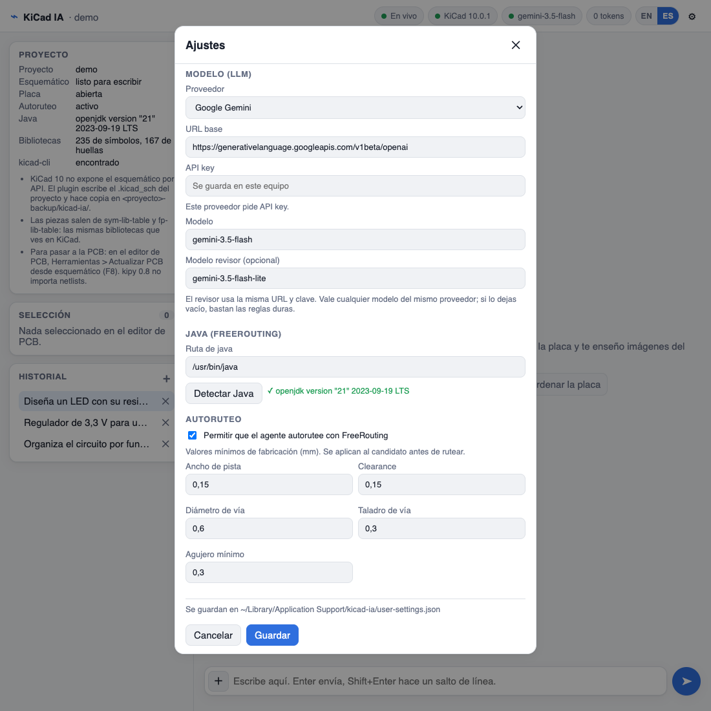
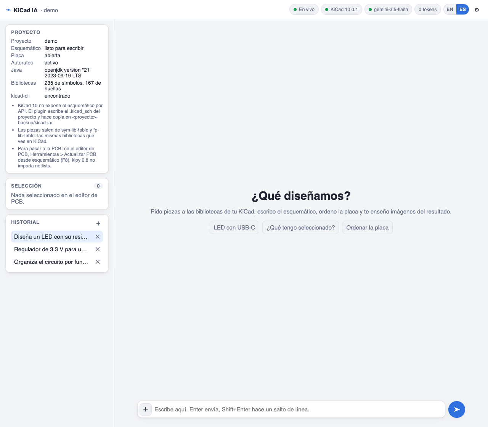
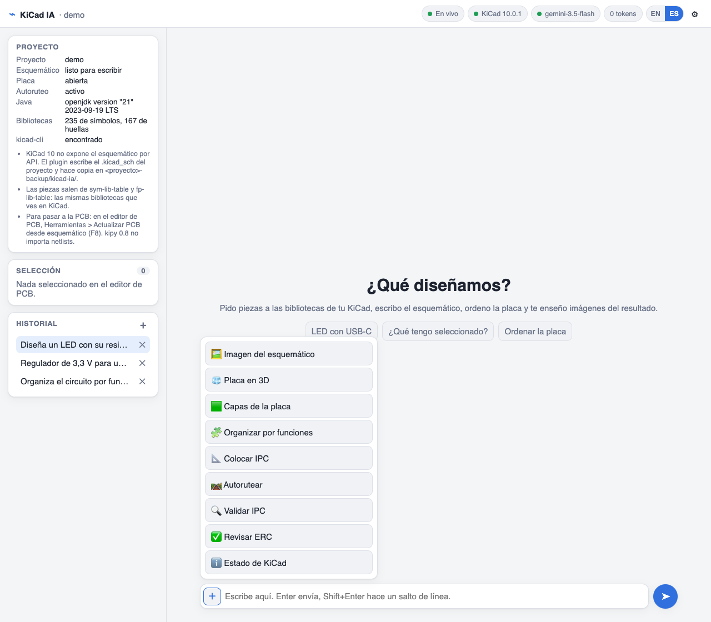

[English](README.md) · **Español**

<a href="https://krisskira.github.io/kicad-ia-chat/">
  
</a>

# KiCad IA

Plugin con IA para KiCad 10, de la idea a la PCB. Cuentas el circuito en un chat y arma el esquemático con tus propias bibliotecas, cada pieza con su huella. Luego lo organiza en la placa, propone la colocación y la autorutea con revisión DRC. Tú confirmas cada paso.

[Página](https://krisskira.github.io/kicad-ia-chat/) · [Código](https://github.com/krisskira/kicad-ia-chat)

## Qué hace

- Busca símbolos y huellas en `sym-lib-table` y `fp-lib-table`, las mismas bibliotecas que ves en KiCad.
- Escribe el `.kicad_sch` del proyecto y deja una copia en `<proyecto>-backups/kicad-ia/`.
- Si la pieza no está, no dibuja otra en su lugar.
- No escribe un componente sin huella. Si el símbolo no la trae, elige una de tus bibliotecas con el mismo número de pads o te pregunta.
- Si una referencia ya está en el esquemático y en la placa, la conserva con su id. No la duplica ni rompe el enlace con la PCB.
- Guarda cada conversación en tu equipo para retomarla después.
- En la placa puede organizar por funciones, proponer una colocación y, si lo activas, autorutear. Colocar y autorutear se aplican cuando confirmas.
- También funciona como servidor MCP: Cursor u otro cliente compatible usan las mismas herramientas sobre el KiCad abierto. Ver [MCP](#mcp-cursor-y-otros-clientes).

El arranque para quien desarrolla el plugin está en [`app/README.es.md`](app/README.es.md).

## Flujo


1. Abre el proyecto en KiCad 10 y entra al editor de PCB.
2. Pulsa **KiCad IA**. Se abre el chat en el navegador, en `http://127.0.0.1:8765`.
3. En **Ajustes** elige el modelo. Sin modelo puedes consultar el estado; para diseñar hace falta un modelo.
4. Describe el circuito, o pulsa el **＋** del campo de texto para una acción rápida: imagen, organizar, colocar, autorutear, validar o revisar el ERC.
5. Cierra el editor de esquemáticos. KiCad 10 no deja escribir el esquemático por API: el plugin edita el archivo y, si el editor está abierto, no lo toca.
6. En el editor de PCB: **Herramientas → Actualizar PCB desde el esquemático** (F8). El plugin no importa la netlist por su cuenta.
7. Colocar y autorutear enseñan primero la propuesta. Se aplican a la placa cuando confirmas. Validar corrige solo lo que puede hacer con seguridad. El informe de colocación es un prechequeo IPC Clase 2, no una certificación.

## Instalación

Hace falta **KiCad 10**. La primera vez KiCad necesita red para instalar las dependencias del plugin. Java 17 o posterior solo hace falta si vas a autorutear. Abre KiCad una vez antes de instalar, para que exista `Documentos/KiCad/<versión>/`.

Usa una sola vía. Los scripts y el zip dejan el plugin en `Documentos/KiCad/<versión>/plugins/kicad-ia`; el Gestor de complementos lo guarda en su propia carpeta de complementos. Después reinicia KiCad, abre el editor de PCB, pulsa **KiCad IA** y configura el modelo.

### Gestor de complementos

1. En KiCad: Preferencias → Gestor de complementos → repositorios.
2. Añade esta URL y instala **KiCad IA**:

```text
https://raw.githubusercontent.com/krisskira/kicad-ia-chat/main/app/packaging/repository.json
```

3. Reinicia KiCad y abre el editor de PCB.

### Script en macOS o Linux

Necesita `curl` y `unzip`. Baja el último release, comprueba su SHA256 y, si ya había una copia, la deja en `kicad-ia.bak`.

```bash
curl -fsSL https://raw.githubusercontent.com/krisskira/kicad-ia-chat/main/install/install.sh | sh
```

Una versión o una carpeta de KiCad concretas, o desinstalar:

```bash
curl -fsSL https://raw.githubusercontent.com/krisskira/kicad-ia-chat/main/install/install.sh | sh -s -- --version 0.1.0 --kicad-version 10.0
curl -fsSL https://raw.githubusercontent.com/krisskira/kicad-ia-chat/main/install/install.sh | sh -s -- --uninstall
```

Si prefieres leerlo antes: descárgalo con `curl -fsSL … -o install.sh` y ejecuta `sh install.sh` con las mismas opciones.

### Script en Windows

En PowerShell. Hace lo mismo que el de macOS y Linux:

```powershell
irm https://raw.githubusercontent.com/krisskira/kicad-ia-chat/main/install/install.ps1 | iex
```

Una versión o una carpeta de KiCad concretas, o desinstalar:

```powershell
& ([scriptblock]::Create((irm https://raw.githubusercontent.com/krisskira/kicad-ia-chat/main/install/install.ps1))) -Version 0.1.0 -KicadVersion 10.0
& ([scriptblock]::Create((irm https://raw.githubusercontent.com/krisskira/kicad-ia-chat/main/install/install.ps1))) -Uninstall
```

Si lo descargas, ejecuta `.\install.ps1` con los mismos parámetros.

### Copia del zip

1. En [Releases](https://github.com/krisskira/kicad-ia-chat/releases) descarga `kicad-ia-<versión>.zip` (no el `-pcm.zip`, que es para el Gestor).
2. Descomprímelo de modo que `plugin.json` e `ipc_entry.py` queden en la raíz de `plugins/kicad-ia`. Cambia `10.0` y `0.1.0` por tus versiones:

```bash
# macOS y Linux
mkdir -p ~/Documents/KiCad/10.0/plugins/kicad-ia
unzip kicad-ia-0.1.0.zip -d ~/Documents/KiCad/10.0/plugins/kicad-ia
```

```powershell
# Windows
Expand-Archive kicad-ia-0.1.0.zip (Join-Path ([Environment]::GetFolderPath('MyDocuments')) 'KiCad\10.0\plugins\kicad-ia')
```

## Ajustes



En el engranaje del chat, sin editar archivos:

| Bloque | Qué configuras |
|--------|----------------|
| Modelo | Proveedor: Google Gemini, Ollama local, OpenAI o una URL compatible con OpenAI. También la API key, el modelo y, si quieres, un modelo revisor. |
| Java | Ruta de `java`, o **Detectar Java**. Hace falta para autorutear. |
| Autoruteo | Apagado hasta que lo activas. Entonces pides ancho de pista, clearance, vía, taladro y agujero mínimo, en milímetros. |

El modelo revisor es opcional. Si lo dejas vacío, el chat escribe sin esa segunda lectura.

Se guardan en este equipo y mandan sobre un `.env`:

- macOS: `~/Library/Application Support/kicad-ia/user-settings.json`
- Linux y Windows: `~/.config/kicad-ia/user-settings.json`

La API key no va en el repositorio. El autoruteo usa FreeRouting 2.0.1 y Java 17 o posterior. Sigue apagado hasta que lo actives y definas esos mínimos.

## El chat



La barra superior dice si el canal está en vivo, si KiCad responde, qué modelo hay y cuántos tokens van. Si el proveedor no informa el consumo, el número es una estimación y lleva `~`. **EN** / **ES** cambia el idioma de la interfaz: el inglés es el de partida.

A la izquierda ves el proyecto, la selección del editor de PCB y el historial de este proyecto. Un clic enseña una sesión en solo lectura; no la continúa ni deshace lo hecho. El chat la usa como resumen de lo ya decidido en ese proyecto, y otro proyecto no la ve. El **＋** empieza otra sesión y la **✕** la borra. Se guardan en la carpeta `sessions/`, junto a los ajustes, sin la API key.



Las acciones rápidas están en el **＋** del campo de texto. El autoruteo solo aparece en esa lista si lo activaste.

Puedes pedir, por ejemplo:

- «Diseña un LED con su resistencia alimentado a 5 V por USB-C.»
- «Enséñame la placa en 3D.»
- «Organiza el circuito por funciones.»
- «Coloca los componentes. Primero la propuesta, sin aplicar.»
- «Valida el esquemático y dime qué hay que corregir.»

## MCP (Cursor y otros clientes)

KiCad IA también es un servidor MCP. Cursor, Claude Desktop o cualquier cliente compatible usan las mismas herramientas que el chat sobre el KiCad que tienes abierto. El modelo lo pone ese cliente: no hace falta configurar uno en Ajustes.

Las reglas son las mismas que en el chat. El circuito pasa por el contrato y por la selección con huella verificada, el editor de esquemáticos tiene que estar cerrado para escribir, y colocar y autorutear dan primero una propuesta. El autoruteo solo aparece si lo activaste en Ajustes. Los revisores del chat no corren por MCP: la revisión queda en manos del modelo del cliente. El chat y el MCP pueden funcionar a la vez.

El plugin que instala KiCad no trae el servidor MCP. Hace falta una copia del repositorio con su propio entorno de Python (3.9 o posterior).

### 1. Prepara el entorno

macOS y Linux:

```bash
git clone https://github.com/krisskira/kicad-ia-chat.git
cd kicad-ia-chat/app
python3 -m venv .venv
.venv/bin/pip install -e ".[mcp,kicad]"
.venv/bin/python -m kicad_ia.mcp   # prueba con KiCad abierto; Ctrl+C para salir
```

Windows (PowerShell):

```powershell
git clone https://github.com/krisskira/kicad-ia-chat.git
cd kicad-ia-chat\app
py -m venv .venv
.venv\Scripts\pip install -e ".[mcp,kicad]"
.venv\Scripts\python -m kicad_ia.mcp   # prueba con KiCad abierto; Ctrl+C para salir
```

La prueba se queda esperando sin errores: es normal, el servidor habla por la entrada estándar y quien lo arranca de verdad es tu cliente MCP.

### 2. Conéctalo a Cursor

Añade el servidor a `.cursor/mcp.json` del proyecto o a `~/.cursor/mcp.json`. Cambia las rutas por las de tu copia; en Windows el Python está en `.venv/Scripts/python.exe`.

```json
{
  "mcpServers": {
    "kicad-ia": {
      "command": "/ruta/a/kicad-ia-chat/app/.venv/bin/python",
      "args": ["-m", "kicad_ia.mcp"],
      "cwd": "/ruta/a/kicad-ia-chat/app",
      "env": { "KICAD_MODE": "auto" }
    }
  }
}
```

Reinicia los servidores MCP de Cursor y comprueba que `kicad-ia` aparece con sus herramientas. Otros clientes usan el mismo comando, argumento y carpeta. Detalle en [`app/doc/mcp.md`](app/doc/mcp.md).
