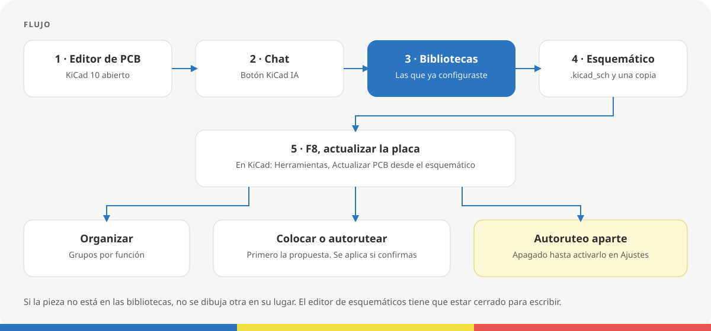
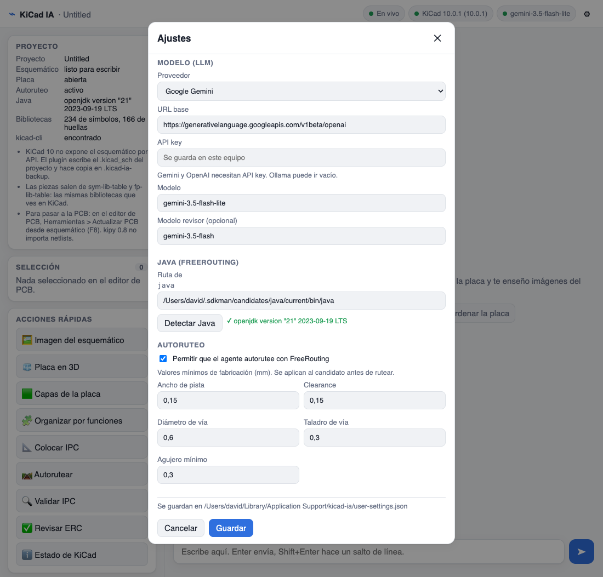
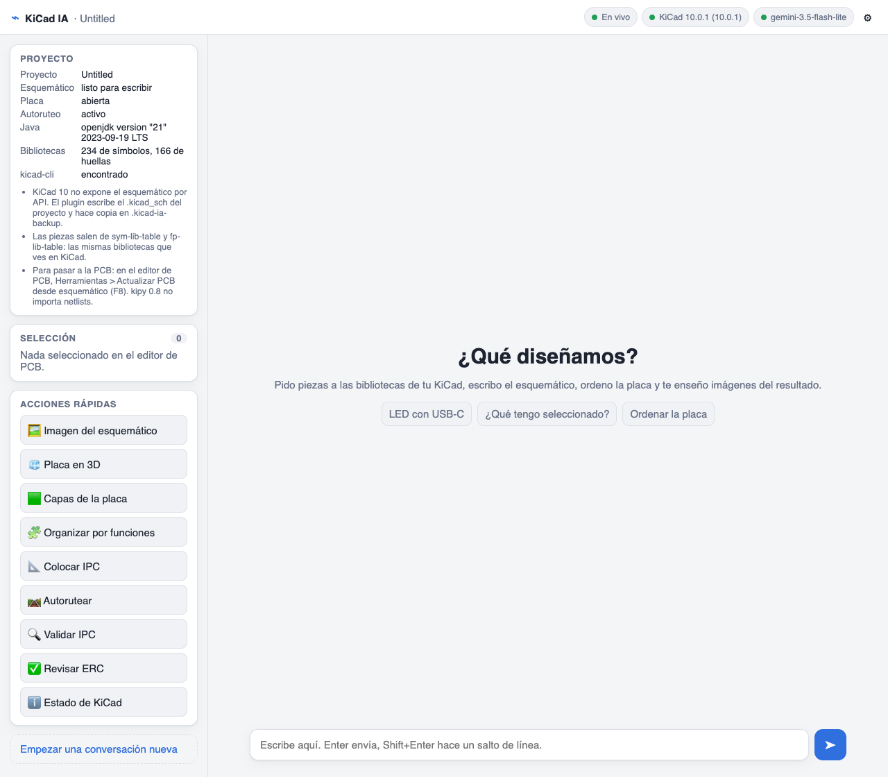

<a href="https://krisskira.github.io/kicad-ia-pluging/">
  
</a>

# KiCad IA

Plugin para KiCad 10. Describes el circuito en un chat y las piezas salen de las bibliotecas que ya tienes configuradas. El resultado es el esquemático del proyecto abierto; a la placa se pasa con F8.

[Página](https://krisskira.github.io/kicad-ia-pluging/) · [Código](https://github.com/krisskira/kicad-ia-pluging)

## Qué hace

- Busca símbolos y huellas en `sym-lib-table` y `fp-lib-table`, las mismas bibliotecas que ves en KiCad.
- Escribe el `.kicad_sch` del proyecto y deja una copia en `.kicad-ia-backup/`.
- Si la pieza no está, no dibuja otra en su lugar.
- En la placa puede organizar por funciones, proponer una colocación y, si lo activas, autorutear. Colocar y autorutear se aplican cuando confirmas.

El arranque para quien desarrolla el plugin está en [`app/README.md`](app/README.md).

## Flujo



1. Abre el proyecto en KiCad 10 y entra al editor de PCB.
2. Pulsa **KiCad IA**. Se abre el chat en el navegador, en `http://127.0.0.1:8765`.
3. En **Ajustes** elige el modelo. Sin modelo puedes consultar el estado; para diseñar hace falta un modelo.
4. Describe el circuito, o usa una acción rápida: imagen, organizar, colocar, autorutear, validar o revisar el ERC.
5. Cierra el editor de esquemáticos. KiCad 10 no deja escribir el esquemático por API: el plugin edita el archivo y, si el editor está abierto, no lo toca.
6. En el editor de PCB: **Herramientas → Actualizar PCB desde el esquemático** (F8). El plugin no importa la netlist por su cuenta.
7. Colocar y autorutear enseñan primero la propuesta. Se aplican a la placa cuando confirmas. Validar corrige solo lo que puede hacer con seguridad. El informe de colocación es un prechequeo IPC Clase 2, no una certificación.

## Instalación

Hace falta **KiCad 10**. La primera vez KiCad necesita red para instalar las dependencias del plugin. Java 17 o posterior solo hace falta si vas a autorutear. Abre KiCad una vez antes de instalar, para que exista `Documentos/KiCad/<versión>/`.

Las cuatro vías dejan el plugin en `Documentos/KiCad/<versión>/plugins/kicad-ia`. Después reinicia KiCad, abre el editor de PCB, pulsa **KiCad IA** y configura el modelo.

### Gestor de complementos

1. En KiCad: Preferencias → Gestor de complementos → repositorios.
2. Añade esta URL y instala **KiCad IA**:

```text
https://raw.githubusercontent.com/krisskira/kicad-ia-pluging/main/app/packaging/repository.json
```

3. Reinicia KiCad y abre el editor de PCB.

### Script en macOS o Linux

```bash
curl -fsSL https://raw.githubusercontent.com/krisskira/kicad-ia-pluging/main/install/install.sh | sh
```

Opciones: `--version 0.1.0`, `--kicad-version 10.0`, `--uninstall`.

### Script en Windows

En PowerShell:

```powershell
irm https://raw.githubusercontent.com/krisskira/kicad-ia-pluging/main/install/install.ps1 | iex
```

Parámetros: `-Version 0.1.0`, `-KicadVersion 10.0`, `-Uninstall`.

### Copia del zip

1. En [Releases](https://github.com/krisskira/kicad-ia-pluging/releases) descarga `kicad-ia-<versión>.zip`.
2. Descomprímelo de modo que `plugin.json` e `ipc_entry.py` queden en la raíz de:

```text
~/Documents/KiCad/<versión>/plugins/kicad-ia
```

En Windows: `Documentos\KiCad\<versión>\plugins\kicad-ia`.

## Ajustes



En el engranaje del chat, sin editar archivos:

| Bloque | Qué configuras |
|--------|----------------|
| Modelo | Proveedor: Google Gemini, Ollama local, OpenAI o una URL compatible con OpenAI. También la API key, el modelo y, si quieres, un modelo revisor. |
| Java | Ruta de `java`, o **Detectar Java**. Hace falta para autorutear. |
| Autoruteo | Apagado hasta que lo activas. Entonces pides ancho de pista, clearance, vía, taladro y agujero mínimo, en milímetros. |

El modelo revisor es opcional. Si lo dejas vacío, el chat escribe sin esa segunda lectura.

Se guardan en este equipo y mandan sobre un `.env`:

- macOS: `~/Library/Application Support/kicad-ia/user-settings.json`
- Linux y Windows: `~/.config/kicad-ia/user-settings.json`

La API key no va en el repositorio. El autoruteo usa FreeRouting 2.0.1 y Java 17 o posterior. Sigue apagado hasta que lo actives y definas esos mínimos.

## El chat



La barra superior dice si el canal está en vivo, si KiCad responde y qué modelo hay. A la izquierda ves el proyecto, la selección del editor de PCB y las acciones rápidas. El autoruteo solo aparece en esa lista si lo activaste.

Puedes pedir, por ejemplo:

- «Diseña un LED con su resistencia alimentado a 5 V por USB-C.»
- «Enséñame la placa en 3D.»
- «Organiza el circuito por funciones.»
- «Coloca los componentes. Primero la propuesta, sin aplicar.»
- «Valida el esquemático y dime qué hay que corregir.»

Quien quiera el mismo trabajo desde Cursor: la configuración está en [`app/doc/mcp.md`](app/doc/mcp.md).
