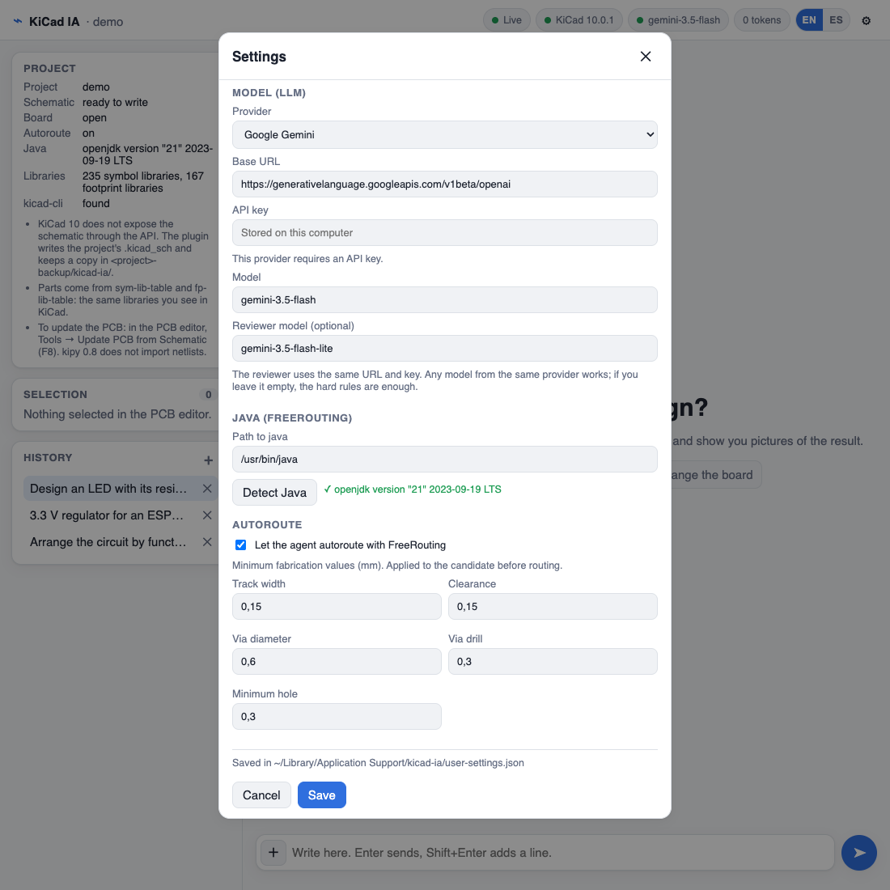
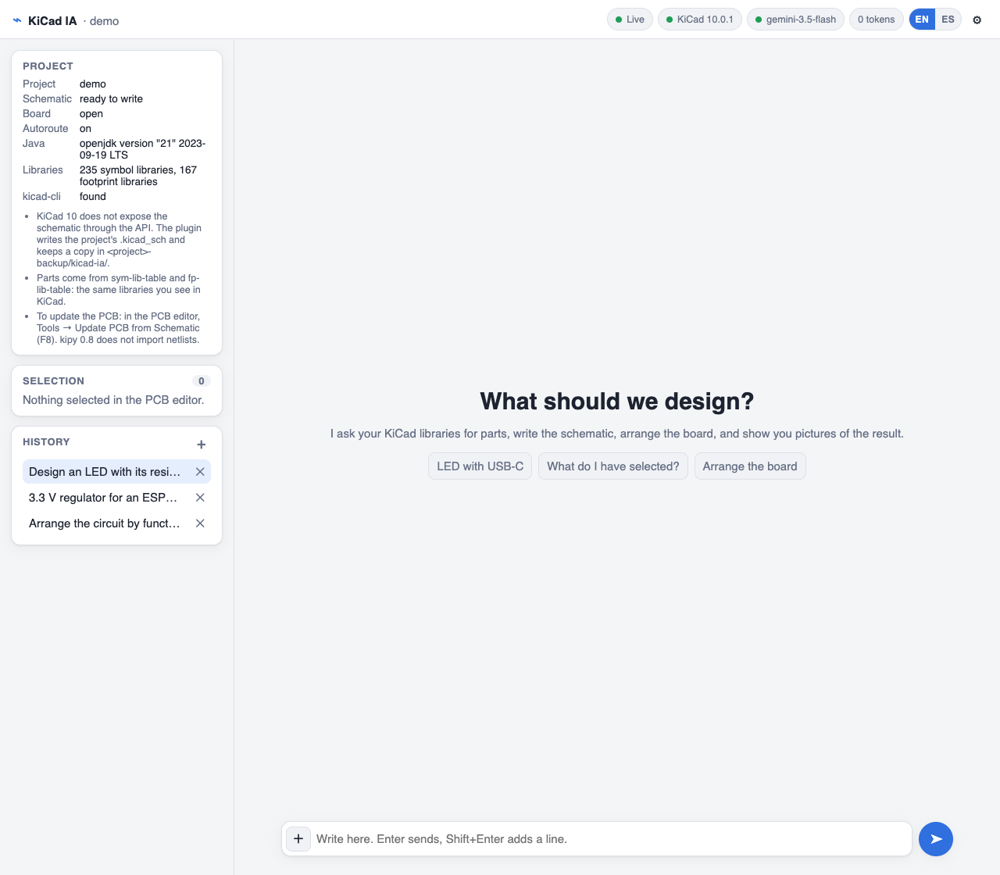
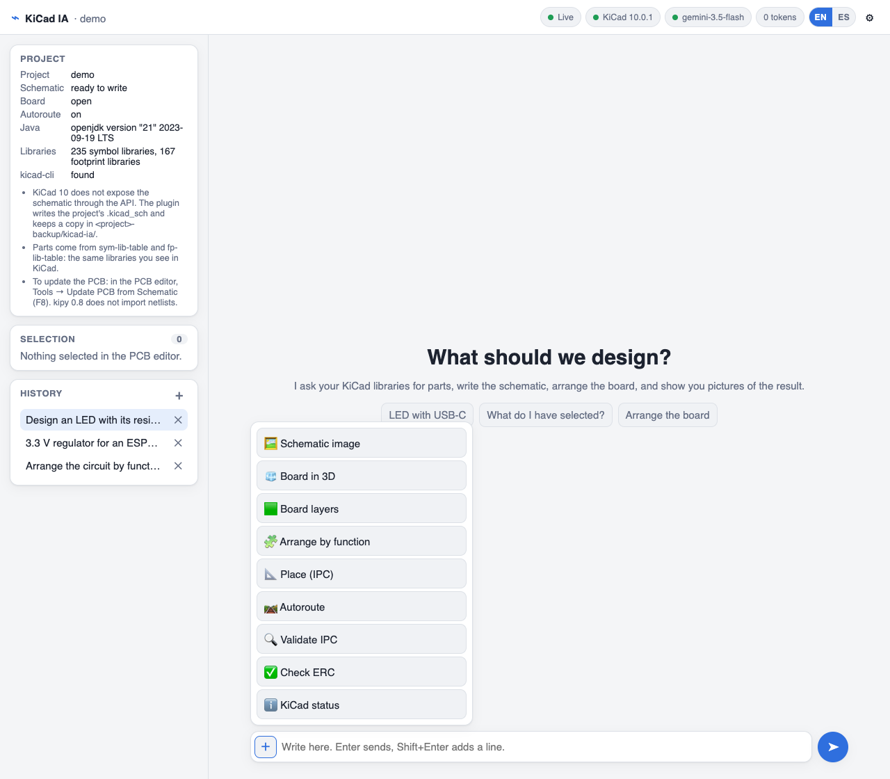

**English** · [Español](README.es.md)

<a href="https://krisskira.github.io/kicad-ia-chat/">
  
</a>

# KiCad IA

An AI plugin for KiCad 10, from the idea to the PCB. You describe the circuit in a chat and it builds the schematic from your own libraries, each part with its footprint. Then it arranges the board, proposes a placement, and autoroutes it with a DRC review. You confirm each step.

[Website](https://krisskira.github.io/kicad-ia-chat/) · [Code](https://github.com/krisskira/kicad-ia-chat)

## What it does

- Looks up symbols and footprints in `sym-lib-table` and `fp-lib-table`, the same libraries you see in KiCad.
- Writes the project's `.kicad_sch` and keeps a copy in `<project>-backups/kicad-ia/`.
- If a part is not there, it does not draw a different one in its place.
- It does not place a component without a footprint. If the symbol has none, it picks one from your libraries with the same pad count, or it asks you.
- If a reference is already on the schematic and on the board, it keeps it with its id. It does not duplicate it or break the link to the PCB.
- Saves each conversation on your computer so you can come back to it.
- On the board it can arrange by function, propose a placement, and, if you turn it on, autoroute. Placement and autorouting are applied when you confirm.
- It also works as an MCP server: Cursor or another compatible client uses the same tools on the KiCad you have open. See [MCP](#mcp-cursor-and-other-clients).

How to run the plugin while developing it is in [`app/README.md`](app/README.md).

## Flow


1. Open the project in KiCad 10 and go to the PCB editor.
2. Click **KiCad IA**. The chat opens in the browser at `http://127.0.0.1:8765`.
3. In **Settings**, choose the model. Without a model you can still check status; designing needs a model.
4. Describe the circuit, or press **＋** in the text field for a quick action: image, arrange, place, autoroute, validate, or check the ERC.
5. Close the schematic editor. KiCad 10 cannot write the schematic through the API: the plugin edits the file and, if the editor is open, it leaves it alone.
6. In the PCB editor: **Tools → Update PCB from Schematic** (F8). The plugin does not import the netlist on its own.
7. Place and autoroute show the proposal first. They are applied to the board when you confirm. Validate only fixes what it can do safely. The placement report is an IPC Class 2 pre-check, not a certification.

## Installation

You need **KiCad 10**. The first time, KiCad needs a network connection to install the plugin's dependencies. Java 17 or later is required only if you will autoroute. Open KiCad once before installing, so that `Documents/KiCad/<version>/` exists.

Use only one method. The scripts and the zip put the plugin in `Documents/KiCad/<version>/plugins/kicad-ia`; the Plugin and Content Manager stores it in its own plugins folder. Then restart KiCad, open the PCB editor, click **KiCad IA**, and set the model.

### Plugin and Content Manager

1. In KiCad: Preferences → Plugin and Content Manager → repositories.
2. Add this URL and install **KiCad IA**:

```text
https://raw.githubusercontent.com/krisskira/kicad-ia-chat/main/app/packaging/repository.json
```

3. Restart KiCad and open the PCB editor.

### Script on macOS or Linux

Needs `curl` and `unzip`. It downloads the latest release, checks its SHA256, and, if a copy was already there, moves it to `kicad-ia.bak`.

```bash
curl -fsSL https://raw.githubusercontent.com/krisskira/kicad-ia-chat/main/install/install.sh | sh
```

A specific version or KiCad folder, or uninstall:

```bash
curl -fsSL https://raw.githubusercontent.com/krisskira/kicad-ia-chat/main/install/install.sh | sh -s -- --version 0.1.0 --kicad-version 10.0
curl -fsSL https://raw.githubusercontent.com/krisskira/kicad-ia-chat/main/install/install.sh | sh -s -- --uninstall
```

If you would rather read it first: download it with `curl -fsSL … -o install.sh` and run `sh install.sh` with the same options.

### Script on Windows

In PowerShell. It does the same as the macOS and Linux script:

```powershell
irm https://raw.githubusercontent.com/krisskira/kicad-ia-chat/main/install/install.ps1 | iex
```

A specific version or KiCad folder, or uninstall:

```powershell
& ([scriptblock]::Create((irm https://raw.githubusercontent.com/krisskira/kicad-ia-chat/main/install/install.ps1))) -Version 0.1.0 -KicadVersion 10.0
& ([scriptblock]::Create((irm https://raw.githubusercontent.com/krisskira/kicad-ia-chat/main/install/install.ps1))) -Uninstall
```

If you download it, run `.\install.ps1` with the same parameters.

### Copy of the zip

1. From [Releases](https://github.com/krisskira/kicad-ia-chat/releases) download `kicad-ia-<version>.zip` (not the `-pcm.zip`, which is for the Plugin Manager).
2. Unzip it so that `plugin.json` and `ipc_entry.py` sit at the root of `plugins/kicad-ia`. Replace `10.0` and `0.1.0` with your versions:

```bash
# macOS and Linux
mkdir -p ~/Documents/KiCad/10.0/plugins/kicad-ia
unzip kicad-ia-0.1.0.zip -d ~/Documents/KiCad/10.0/plugins/kicad-ia
```

```powershell
# Windows
Expand-Archive kicad-ia-0.1.0.zip (Join-Path ([Environment]::GetFolderPath('MyDocuments')) 'KiCad\10.0\plugins\kicad-ia')
```

## Settings



From the gear in the chat, without editing files:

| Block | What you set |
|--------|----------------|
| Model | Provider: Google Gemini, local Ollama, OpenAI, or an OpenAI-compatible URL. Also the API key, the model, and, if you want, a reviewer model. |
| Java | Path to `java`, or **Detect Java**. Required for autorouting. |
| Autoroute | Off until you turn it on. Then it asks for minimum track width, clearance, via, drill, and hole, in millimeters. |

The reviewer model is optional. If you leave it empty, the chat writes without that second reading.

They are stored on this computer and override a `.env`:

- macOS: `~/Library/Application Support/kicad-ia/user-settings.json`
- Linux and Windows: `~/.config/kicad-ia/user-settings.json`

The API key does not go in the repository. Autorouting uses FreeRouting 2.0.1 and Java 17 or later. It stays off until you turn it on and set those minimums.

## The chat



The top bar says whether the channel is live, whether KiCad is responding, which model is in use, and how many tokens have been used. If the provider does not report usage, the number is an estimate and is marked with `~`. **EN** / **ES** switches the interface language. English is the starting language.

On the left you see the project, the PCB editor selection, and this project's history. A click shows a session as read-only; it does not continue it or undo what was done. The chat uses it as a summary of what was already decided in that project, and another project does not see it. **＋** starts another session and **✕** deletes it. Sessions are stored in the `sessions/` folder, next to the settings, without the API key.



Quick actions are in the **＋** of the text field. Autoroute appears in that list only if you turned it on.

You can ask, for example:

- "Design an LED with its resistor, powered at 5 V from USB-C."
- "Show me the board in 3D."
- "Arrange the circuit by function."
- "Place the components. Show the proposal first, without applying it."
- "Validate the schematic and tell me what needs fixing."

## MCP (Cursor and other clients)

KiCad IA is also an MCP server. Cursor, Claude Desktop, or any compatible client uses the same tools as the chat on the KiCad you have open. That client supplies the model: you do not need to set one in Settings.

The rules are the same as in the chat. The circuit goes through the contract and through selection with a verified footprint, the schematic editor has to be closed to write, and place and autoroute give a proposal first. Autoroute appears only if you turned it on in Settings. The chat's reviewers do not run over MCP: review stays with the client's model. The chat and MCP can run at the same time.

The plugin KiCad installs does not include the MCP server. You need a copy of the repository with its own Python environment (3.9 or later).

### 1. Prepare the environment

macOS and Linux:

```bash
git clone https://github.com/krisskira/kicad-ia-chat.git
cd kicad-ia-chat/app
python3 -m venv .venv
.venv/bin/pip install -e ".[mcp,kicad]"
.venv/bin/python -m kicad_ia.mcp   # try it with KiCad open; Ctrl+C to quit
```

Windows (PowerShell):

```powershell
git clone https://github.com/krisskira/kicad-ia-chat.git
cd kicad-ia-chat\app
py -m venv .venv
.venv\Scripts\pip install -e ".[mcp,kicad]"
.venv\Scripts\python -m kicad_ia.mcp   # try it with KiCad open; Ctrl+C to quit
```

The trial sits waiting with no errors: that is normal. The server speaks over standard input, and the MCP client is what actually starts it.

### 2. Connect it to Cursor

Add the server to the project's `.cursor/mcp.json` or to `~/.cursor/mcp.json`. Replace the paths with those of your copy; on Windows Python is at `.venv/Scripts/python.exe`.

```json
{
  "mcpServers": {
    "kicad-ia": {
      "command": "/path/to/kicad-ia-chat/app/.venv/bin/python",
      "args": ["-m", "kicad_ia.mcp"],
      "cwd": "/path/to/kicad-ia-chat/app",
      "env": { "KICAD_MODE": "auto" }
    }
  }
}
```

Restart Cursor's MCP servers and check that `kicad-ia` shows up with its tools. Other clients use the same command, argument, and folder. Detail in [`app/doc/mcp.md`](app/doc/mcp.md).
