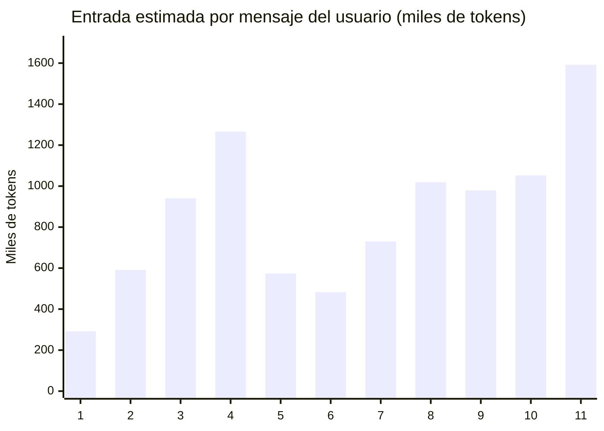
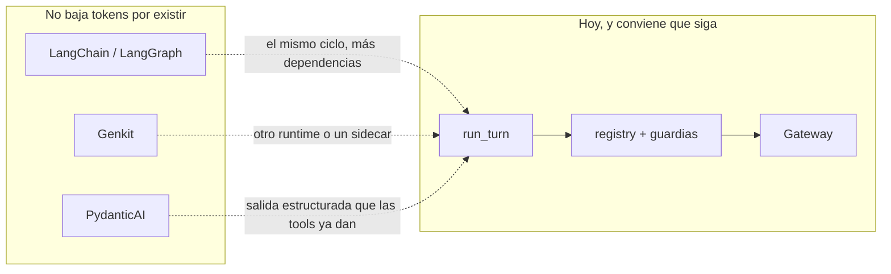

# Coste del agente — medición y plan

Qué conviene hacer con el orquestador de `agent/loop.py`: seguir con el bucle propio y recortar lo que se reenvía, o pasarlo a un framework con razonamiento (LangChain, LangGraph, Genkit u otro).

La conclusión, con la medición debajo:

> El framework no baja la factura. El gasto está en reenviar el historial y en gastar una ronda de modelo por cada herramienta. Eso se arregla en este bucle. Un grafo nuevo solo compensa cuando existan los agentes separados que [agents.md](agents.md) todavía no implementa.

Los gráficos de la misma medición están en el canvas `agente-coste` (junto al chat de Cursor). Este archivo es la fuente que se puede versionar.

## Cómo se midió

No hay telemetría del proveedor dentro de la sesión. `TokenMeter` suma el proceso entero y no guarda el `usage` de cada ronda. La cifra de aquí usa el mismo estimador del producto, `rough_tokens` en `agent/llm.py`: unos 4 caracteres por token. En JSON el tokenizador real suele ir un poco peor, así que estas cifras son un piso, no una factura.

La muestra es la única conversación guardada en este equipo (`sessions/*.json`, 587 KB), leída el 2 de octubre de 2026. Once mensajes de usuario, un proyecto. No se cita el contenido del diseño: solo tamaños, nombres de herramienta y campos de control (`ok`, `written`, `review`, `decision`).

El prefijo fijo se midió en código, con `FakeGateway` y `build_registry()`:

| Pieza | Tokens estimados |
|---|---:|
| Prompt de sistema, sin resumen de otras sesiones | 1.597 |
| El mismo prompt con el resumen al tope (3.500 caracteres) | 2.534 |
| Esquema de las 20 herramientas | 3.066 |
| Prefijo de una llamada (sistema + herramientas) | 4.663 |
| Revisor eléctrico: sistema + herramienta `verdict` | 275 |
| Revisor de PCB: sistema + `verdict` | 278 |

`capabilities()` dentro del prompt son unos 134 tokens. No es el problema.

## Qué hizo esa conversación

| Hecho | Cifra |
|---|---:|
| Mensajes del usuario | 11 |
| Llamadas al modelo | 135 |
| Mensajes de corte («Paré después de varias herramientas…») | 4 |
| Llamadas a herramientas | 128 |
| Rondas que pidieron más de una herramienta a la vez | 0 |
| Entrada estimada, suma de las 135 llamadas | 9.518.036 tokens |
| De esa entrada, historial reenviado | 8.888.531 (93,4 %) |
| De esa entrada, prefijo sistema + herramientas | 629.505 (6,6 %) |
| Salida estimada del modelo | 68.996 tokens |
| Mediana de entrada por llamada | 59.567 |
| Última llamada | 153.203 |
| Primera llamada | 4.724 |

El prompt ya pide agrupar búsquedas y descripciones que no dependen entre sí. En esta sesión no ocurrió ni una vez: 128 de 128 rondas con herramientas trajeron una sola.

Cuatro de los once mensajes (los cuatro primeros) llegaron al tope de `MAX_ROUNDS` (20) y el bucle cortó. El usuario no recibió un cierre del modelo: recibió el texto fijo de parada. Esos cuatro mensajes son también los que más hinchan lo que viene después, porque sus resultados de herramienta se quedan en `session.messages` y se reenvían enteros.

Los mensajes 1 a 4 son los que chocaron con las 20 rondas. La barra es la suma de las llamadas de ese mensaje, no una sola petición. A partir del mensaje 5 el modelo ya no llega al tope, pero cada llamada arrastra todo lo anterior: la última llamada del mensaje 11 son 153.203 tokens para responder una frase.

Dentro de cada mensaje, las rondas de la 9 en adelante (el tramo que un circuito guiado no debería necesitar) suman 2.599.882 tokens, el 27,3 % de toda la entrada. Ese porcentaje es un mínimo: no descuenta que esos resultados luego se reenvían en los mensajes siguientes.

## De qué está hecha la entrada

Cada ronda manda de nuevo el prompt, las 20 herramientas y la conversación completa, incluidos los JSON de herramientas de mensajes anteriores. `shrink_step` recorta lo que ve la interfaz (4.000 caracteres). El modelo y el JSON de la sesión reciben el resultado entero.

| Herramienta | Veces | Tamaño medio del resultado |
|---|---:|---:|
| `select_component` | 29 | ~165 tokens |
| `search_parts` | 24 | ~768 |
| `describe_part` | 19 | ~291 |
| `render_view` | 12 | ~20 |
| `autoroute_board` | 9 | ~1.981 |
| `ipc_place_components` | 8 | ~1.087 |
| `place_circuit` | 7 | ~394 |
| `inspect_context` | 4 | ~857 |
| `commit_intent` | 4 | ~180 |
| `board_state` | 3 | ~777 |
| `ipc_validate_correct` | 1 | ~3.549 |

`select_component` respondió `selected` las 29 veces. El algoritmo de selección no está fallando: el orquestador lo vuelve a llamar y luego reenvía la respuesta. En memoria quedaron 24 piezas aceptadas.

21 llamadas repitieron exactamente los mismos argumentos de una llamada anterior. Nueve fueron `render_view`. La repetición ya gastó la ronda; una caché de la herramienta ahorra CPU y puede devolver un resultado corto, pero no borra la llamada al modelo que ya se hizo.

### Revisor

El revisor eléctrico sí corrió (hay campo `review` en los resultados). No entra en las 135 llamadas: es otra petición, con otro cliente, dentro de `place_circuit`.

| `place_circuit` | Veces |
|---|---:|
| Llamadas | 7 |
| Llegó a escribir (`written: true`) | 1 |
| Revisor `approved` | 4 |
| Revisor `rejected` | 2 |
| Revisor `exhausted` | 1 |

Tres diseños que el revisor aprobó no se escribieron. El revisor corre en `_call_tool` antes del registro, y `guard_place` corre dentro del registro. Se paga la revisión y después la guardia puede rechazar el mismo pedido. El caso `exhausted` ya no llama al modelo (el límite es 2 rechazos por mensaje). Las otras seis llamadas de esta sesión sí lo llaman.

En placa, `autoroute_board` acumuló 4 `exhausted` y 1 `rejected`, e `ipc_place_components` 4 `rejected`. Parte de eso puede ser la regla dura de `PcbReviewer`, que no gasta modelo. No se separó una cosa de la otra en el JSON, así que no se suma a la factura.

### Qué costaría a tarifa de lista

El preset de Gemini en Ajustes usa `gemini-2.5-flash` también como modelo revisor. Tarifa de pago publicada por Google (texto, por millón de tokens): entrada $0,30, entrada en caché $0,03, salida $2,50, y la salida incluye los tokens de pensamiento. Fuente: [precios de la API Gemini](https://ai.google.dev/gemini-api/docs/pricing), consultada el 2 de octubre de 2026.

Aplicada a esta estimación, no a un `usage` real:

| Concepto | Tokens | Importe |
|---|---:|---:|
| Entrada de las 135 llamadas | 9.518.036 | $2,86 |
| Salida | 68.996 | $0,17 |
| Total de la conversación, sin revisores | | $3,03 |

Once mensajes, unos $3 en Flash. El mismo volumen de entrada a $2,50 por millón (un modelo de la gama de GPT-4o o Gemini Pro, no medido aquí) serían unos $24 solo de entrada. El patrón importa más que la tarifa: 135 llamadas seguidas es también lo que dispara el HTTP 429 que `OpenAiCompatibleClient` ya reintenta.

Un modelo con razonamiento oculto no quita esas llamadas. Si cada una añadiera 2.000 tokens de pensamiento, a tarifa de salida de Flash serían unos $0,68 extra, y los $2,86 de historial seguirían ahí.

## Qué cambia cada optimización, sobre la misma traza

Se volvió a recorrer las 135 llamadas cambiando solo lo que entraría en el prompt. El modelo haría los mismos pasos. Por eso estas cifras son el ahorro de dejar de reenviar, no el de hacer menos rondas.

| Política | Entrada estimada | Frente al actual | A $0,30 / millón |
|---|---:|---:|---:|
| Actual: historial completo | 9.518.036 | 100 % | $2,86 |
| Al cerrar el mensaje, dejar los `tool` anteriores en un resumen corto | 5.849.204 | 61 % | $1,75 |
| Recortar cada resultado a 1.500 caracteres | 7.340.873 | 77 % | $2,20 |
| Resumen de turnos anteriores y tope de 1.500 | 5.511.980 | 58 % | $1,65 |
| En cada llamada, resultado crudo solo de la última ronda | 5.355.851 | 56 % | $1,61 |
| Solo caché de prefijo (sistema + herramientas gratis desde la 2.ª llamada) | 8.893.194 | 93 % | $2,67 |
| Última ronda cruda y, además, caché de prefijo | 4.731.009 | 50 % | $1,42 |
| Mandar la mitad del esquema de herramientas | ahorro 2,2 % | | ~$0,06 |

La caché de prefijo, que es lo primero que un framework anuncia, vale el 6,6 % de esta sesión. En un mensaje corto pesa más: la primera llamada es prefijo en un 99 %. En una conversación de diseño el historial se lo come.

Recortar a ciegas la última ronda es peor idea que resumir los mensajes ya cerrados. Dentro del mensaje el modelo todavía necesita los pines de `describe_part`. El resumen al cerrar el mensaje conserva el turno en curso intacto y es el cambio con mejor relación entre ahorro medido (−39 % de entrada) y riesgo.

## Frameworks

Ninguno de estos sistemas deja de mandar el historial. El bucle de `run_turn` ya es el ciclo que implementan: el modelo pide una herramienta, el proceso la ejecuta, el resultado vuelve, se repite, con un tope. Pasarlo de sitio no compacta los JSON.

| Criterio | Bucle actual | LangChain / LangGraph | Genkit | PydanticAI u OpenAI Agents |
|---|---|---|---|---|
| ¿Hace cumplir contrato, huella y `apply=false`? | Sí: `guard_place`, `select_component`, revisores | Solo si cada nodo llama al mismo `registry`. Si el grafo invoca tools por su cuenta, el chat y el MCP se separan | El gateway sigue en Python. El flow viviría en otro proceso o en un SDK Python joven | Igual: hay que volver a enchufar el registry |
| ¿Reduce tokens solo por migrar? | El gasto está medido aquí | No. El checkpointer guarda más estado; no lo resume | No. La context cache de Gemini ataca el prefijo (el 6,6 %) | No |
| Razonamiento adaptado a este flujo | La receta ya está en el prompt y en código. El modelo no la agrupó: 0 rondas con varias tools | Un nodo planificador se puede escribir igual en `loop.py` | Flows y evaluadores encajan en un servicio, no dentro de KiCad | Útil si se quiere un veredicto tipado. `verdict` ya es una tool |
| Empaquetado del plugin | Cero dependencias de agente. Python ≥ 3.9 | `langgraph` y `langchain-core` arrastran Pydantic y empujan Python más nuevo. El ZIP de KiCad lo nota | Genkit es sobre todo TypeScript. Un sidecar Node parte el candado de `kipy` | Más liviano que LangChain. Sigue siendo una dependencia nueva |
| Observabilidad | Eventos `llm.round`, `tool.*`, `llm.usage` | LangSmith, de pago, para ver lo que el bus ya publica | UI de desarrollo de Genkit | Depende del SDK |
| Caché del proveedor | El cliente HTTP no pide caché. OpenAI la aplica sola si el prefijo es estable. El endpoint OpenAI de Gemini no expone `cachedContents` | Helpers distintos por proveedor | Context cache si se usa el SDK nativo de Google | Manual |

Genkit no es el sitio de este programa. El plugin es un proceso Python que KiCad arranca, con un gateway que no es seguro entre hilos y con las mismas herramientas servidas por MCP. Partir el agente a un runtime JavaScript obliga a serializar cada lectura de KiCad hacia otro proceso. La caché de contexto de Gemini, que es la pieza útil, se puede pedir desde Python sin Genkit, y en esta sesión solo cubre el prefijo.

LangGraph sí encaja el día que existan los roles que faltan: agente de arquitectura, agentes de etapa, análisis de impacto, deriva de intención. Esos son nodos con estado, que es para lo que sirve un grafo. Hasta entonces el grafo tendría un solo nodo que hace lo que `run_turn` ya hace, más una dependencia.

Un modelo de razonamiento como orquestador va en contra de lo medido. El fallo fue exceso de pasos de una herramienta, no falta de cadena de pensamiento. Cada paso extra de razonamiento se cobra como salida y se multiplica por las 135 llamadas.

## Plan

Ordenado por impacto medido o, donde todavía no se puede medir, por el fallo que la traza ya enseña. Nada de esto cambia el contrato de intención ni las guardias.

### 1. Resumir las herramientas al cerrar el mensaje

Al guardar el turno, sustituir cada mensaje `role: tool` de mensajes ya cerrados por una línea: nombre, `ok`, y los identificadores que el modelo vuelve a necesitar (`lib_id` aceptado, `candidate_id`, `review`, `written`). El turno en curso se queda crudo.

Impacto medido en esta traza: la entrada pasa de 9,52 M a 5,85 M (−39 %), unos $1,10 menos a tarifa Flash, con las mismas 135 llamadas. En disco, la sesión deja de crecer a cientos de KB de JSON que el siguiente mensaje va a releer.

No resumir `describe_part` del turno en curso. Sí se pueden tirar del prompt las rutas de imagen: la interfaz ya las pinta y el modelo tiene prohibido copiar la URL.

### 2. Dejar de chocar con las 20 rondas

Subir `MAX_ROUNDS` empeora la factura: las rondas 9 a 20 de esta traza son el tramo caro, y sus resultados se reenvían después.

Dos cambios, los dos en `loop.py`, sin framework:

- Si en este mensaje ya se llamó la misma herramienta con los mismos argumentos, no se ejecuta otra vez. Se devuelve un aviso corto. En la traza hay 21 repeticiones; `render_view` sola son 9.
- Un plan corto para el camino que el prompt ya describe y el modelo no agrupó. Si no hay contrato, la primera respuesta tiene que ser `commit_intent` e `inspect_context` juntos. Las búsquedas de símbolos que no dependen entre sí salen en la misma respuesta. Hoy eso es una frase del prompt y cero cumplimientos.

El ahorro de hacer menos rondas no está en la tabla de políticas, porque esa tabla no cambia el número de llamadas. El piso medido es el 27 % que son rondas posteriores a la octava. Bajar de 20 a unas 8 en los cuatro mensajes cortados quita ese tramo y, además, encoge los mensajes siguientes. Es el segundo ahorro, y no se suma al 39 %: se solapan.

### 3. Revisor eléctrico en el mismo patrón que el de placa

`PcbReviewer` ya rechaza sin modelo cuando el DRC, el score o el IPC duro fallan. El eléctrico llama al modelo antes de mirar si `guard_place` va a bloquear.

Orden nuevo en `_call_tool`: primero la guardia de intención y la huella; solo si pasarían, el revisor. Las reglas que el prompt del revisor ya enumera (EN del ESP32, enable del regulador a la salida, pin de alimentación suelto, IO35–IO37 en un S3 R8) pueden ser código, como `_hard_block`. El modelo revisor queda para lo que esas reglas no cubren.

En esta sesión, 3 de 4 aprobaciones no escribieron nada. Esas llamadas sobran en cuanto la guardia vaya primero. Hace falta el modelo revisor configurado; si `LLM_REVIEW_MODEL` está vacío, el eléctrico ni siquiera existe.

### 4. Caché de prefijo, sin cambiar de stack

Impacto medido: 6,6 % en una sesión larga, mucho más en la primera llamada de un mensaje corto.

- Con OpenAI, mantener el prefijo byte a byte estable (el resumen de otras sesiones ya va delante; no hay que reordenar herramientas entre rondas). La caché automática exige un prefijo largo y estable. No hay que migrar para eso.
- Con el preset Gemini, el endpoint compatible con OpenAI no expone la context cache. Si se quiere el precio de $0,03 por millón, la llamada de sistema y herramientas tiene que ir por el SDK de Google con `cachedContents`. Es un cambio del cliente, no un framework. El historial sigue yendo en cada llamada.

Mandar solo las herramientas de la fase (esquemático o placa) ahorra alrededor de la mitad de los 3.066 tokens del esquema. En esta sesión eso es el 2 %. Vale como limpieza cuando el mensaje ya se fue a la placa, no como plan de ahorro.

### 5. Memoización que ahorra CPU, no dólares

Ya existe caché en disco de símbolos (`LibraryIndex.symbols`, invalidada por fecha y tamaño). No existe para el listado de huellas: `footprints()` recorre cada `.kicad_mod` y se queda solo en memoria. `describe_symbol` relee el `.kicad_sym` en cada llamada. `capabilities()`, que el vigilante pide cada 1,5 s bajo el candado del gateway, vuelve a preguntar documentos, Java y el resumen de bibliotecas.

Eso se nota en latencia con el plugin en reposo, no en la factura del modelo. Conviene la misma caché por sello de archivo que ya tienen los símbolos, y no meter `capabilities()` en el prompt más de una vez por turno: hoy viaja dentro del sistema y otra vez cuando la herramienta `inspect_context` lo devuelve.

### 6. Medir de verdad antes de la siguiente pasada

Guardar en la sesión el `usage` de cada ronda (entrada, salida, si el proveedor marcó caché), separado del modelo principal y de los revisores. `TokenMeter` puede seguir mostrando el total en la cabecera. Sin eso, la próxima comparación vuelve a ser una estimación de 4 caracteres.

### Qué no hacer ahora

- No sustituir `run_turn` por un agente genérico de LangChain, Genkit o el Agents SDK.
- No poner un modelo de razonamiento como orquestador para «pensar mejor» el mismo ciclo de 20 herramientas.
- No subir el tope de rondas para que los mensajes que hoy se cortan lleguen a terminar: alargan la cola que el mensaje siguiente reenvía.
- No reabrir LangGraph hasta que se implemente un segundo rol de los que lista [agents.md](agents.md). Ese día el grafo tiene nodos que llaman al `registry` actual; no un agente libre con sus propias tools.

## Impacto esperado si se hace 1, 2 y 3

Sobre una conversación como esta, y diciendo de dónde sale cada número:

| Cambio | Qué se mueve | Confianza |
|---|---|---|
| Resumir tools al cerrar el mensaje | −39 % de tokens de entrada, medido rehecho la traza | Alta: es la misma conversación con menos texto |
| No repetir argumentos y no pasar de ~8 rondas en el camino conocido | Al menos el 27 % que hoy son rondas 9–20, más el reenvío posterior de ese texto | Media: el 27 % está medido; cuántas rondas bajará el modelo depende de que el plan agrupado se cumpla |
| Guardia antes del revisor, reglas duras en código | Las llamadas extra del revisor. Aquí, 6 peticiones y 3 aprobaciones que no escribieron | Alta en el orden; el importe es pequeño al lado del historial |
| Caché de prefijo | −7 % en esta sesión larga | Alta como techo. En Gemini hace falta el SDK nativo |
| Migrar a LangChain, Genkit u otro | Cero ahorro de tokens. Coste de empaquetado y riesgo de saltarse el registry | Alta, por cómo están hechos esos frameworks |

El orden de trabajo es el de la tabla: primero dejar de reenviar, después dejar de dar veinte vueltas, después el revisor. El framework espera a que haya más de un agente.

## Estado de implementación (2026-10-05)

Hecho en código, sin migrar a un framework:

| Ítem | Dónde |
|---|---|
| Compactar tools al cerrar el turno | `agent/history.py`, inicio de `_run_turn` |
| Deduplicar tool+args en el mismo mensaje | `agent/loop.py` (reintentos tras rechazo permitidos) |
| `guard_place` antes del revisor; reglas duras eléctricas | `agent/loop.py`, `agent/review.py` |
| Telemetría por llamada (`usage_log`) | `agent/llm.py`, `agent/sessions.py` |
| Revisor opcional en todos los proveedores | `user_prefs.py`, `dispatch.py` (`electrical_review` / `pcb_review`) |
| Etapas del esquemático con elegibilidad de marcos | `kicad/layout.py` (`plan_stages`), `organize_layout` con preview |

Pendiente deliberadamente: caché nativa de un proveedor concreto; subir `MAX_ROUNDS`; LangGraph/Genkit. La compactación, la deduplicación y las reglas duras no dependen de Gemini, OpenAI ni Ollama.
