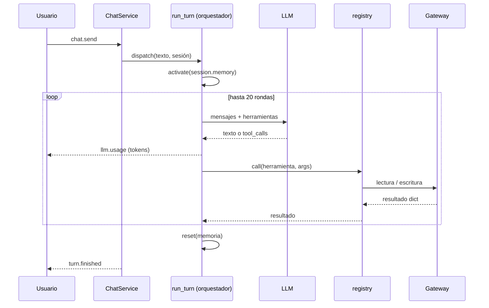
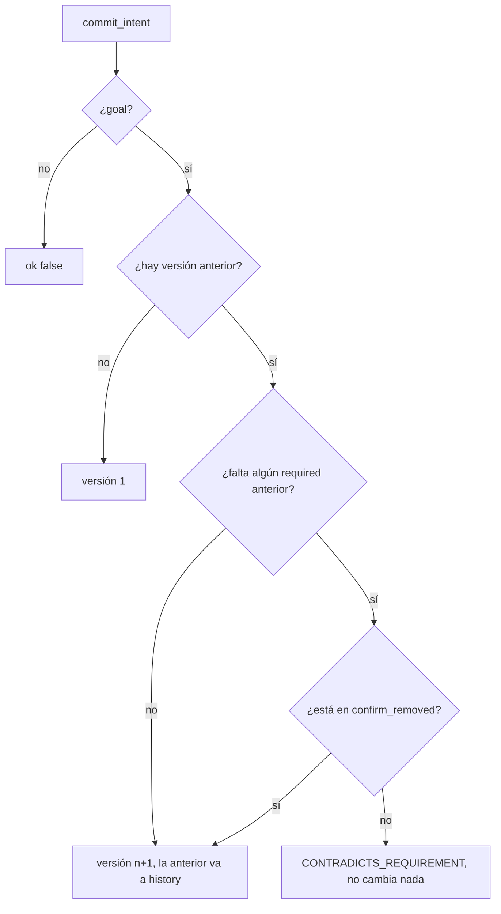
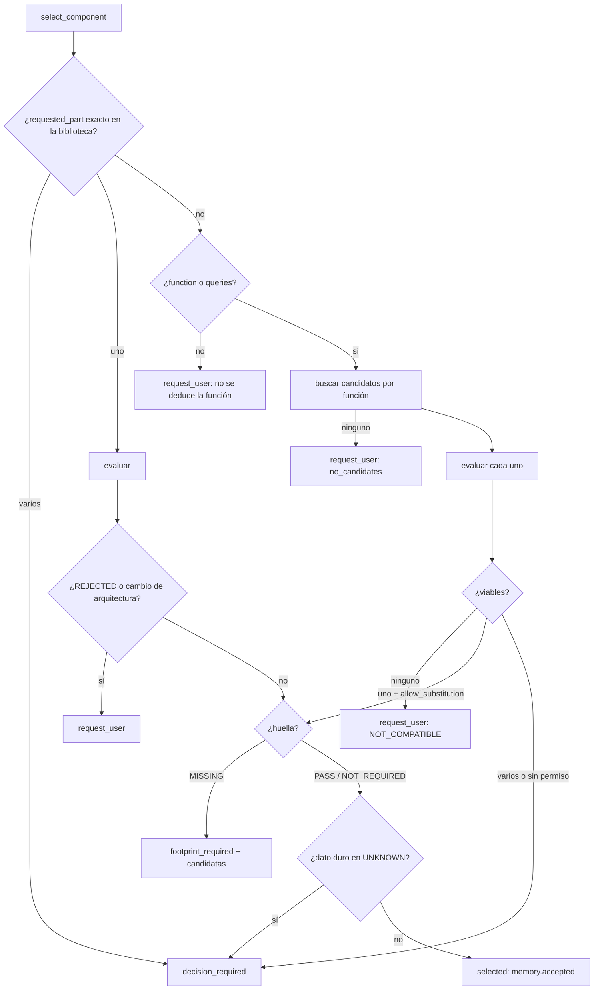
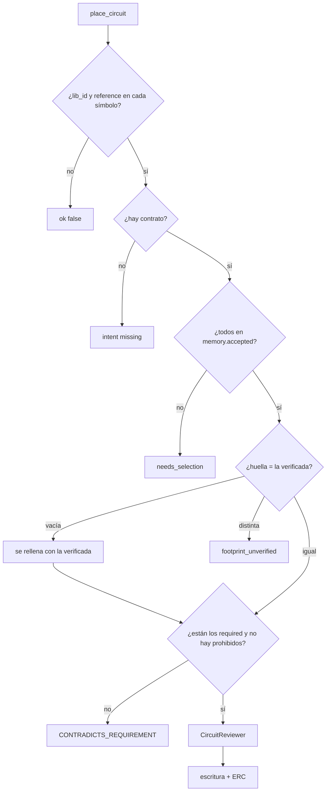
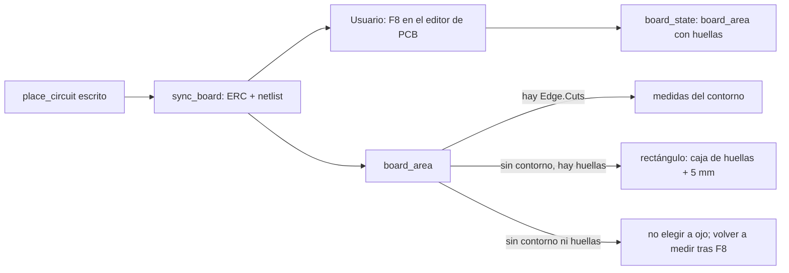
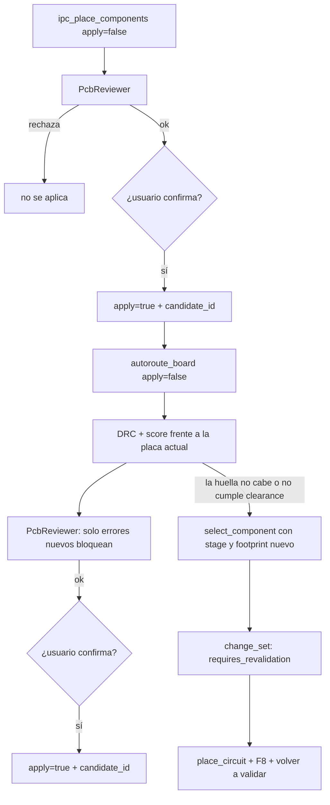

# Agentes y flujos — KiCad IA

Este documento explica cómo decide el chat: quién hace qué, en qué orden y qué
bloquea una escritura. El código está en `src/kicad_ia/agent/` y
`src/kicad_ia/tools/registry.py`.

Principio que manda sobre todo lo demás:

> Ningún agente puede modificar silenciosamente un requisito del usuario para
> hacer que su propia tarea sea más fácil.

## Roles

| Rol | Dónde está | Qué decide | Qué no hace |
|-----|-----------|-----------|-------------|
| Orquestador | `agent/loop.py` (`run_turn`) | Qué herramienta llamar y cuándo, hasta 20 rondas por mensaje | No guarda requisitos; los lee de la memoria |
| Intención | `agent/intent.py` (`commit_intent`, `guard_place`) | Qué pidió el usuario y si un cambio lo contradice | No diseña: no elige piezas, huellas ni posiciones |
| Selección de componentes | `agent/components.py` (`select_component`) | Qué símbolo y qué huella implementan una función | No inventa lib_id, pines, huellas ni datos eléctricos |
| Biblioteca | `kicad/libraries.py`, `lcsc.py` | Cómo se representa la pieza en KiCad (símbolo, huella, 3D) | No decide qué pieza usar |
| Revisor de circuito | `agent/review.py` (`CircuitReviewer`) | Si el circuito de `place_circuit` es eléctricamente correcto | No escribe |
| Revisor de PCB | `agent/pcb_review.py` (`PcbReviewer`) | Si un candidato de colocación o ruteo se puede aplicar | No aplica |
| Gateway | `kicad/kipy_gateway.py`, `fake.py` | Lee y escribe KiCad | No decide nada de diseño |

El orquestador es un único modelo (`LLM_MODEL`) con herramientas. Intención y
selección son código determinista que el modelo invoca y que el registro hace
cumplir. Los revisores usan `LLM_REVIEW_MODEL` si está configurado.

## Turno de chat

`Session.memory` (`DesignMemory`) dura toda la conversación. `run_turn` la fija
en un `ContextVar` para que las herramientas del registro, que solo reciben
`gateway` y `args`, lean la memoria de esa sesión. Fuera del chat (MCP) hay una
memoria por gateway.

## Contrato de intención

`commit_intent` registra lo que pidió el usuario:

| Campo | Contenido |
|-------|-----------|
| `goal` | Qué quiere construir, una frase (obligatorio) |
| `required_functions` | Funciones que debe cumplir |
| `required_components` | Solo lo que el usuario nombró como obligatorio |
| `forbidden_components` | Lo que pidió no usar |
| `preferred` | Preferencias que se pueden romper |
| `constraints` | Tensión, corriente, dimensiones, conectores… |
| `assumptions` | Lo que el modelo supuso y dijo al usuario |
| `unknowns` | Lo que no se dijo; no se rellena |
| `acceptance` | Criterios verificables (AC-01…) |
| `confirm_removed` | Obligatorios que el usuario autorizó quitar |

Las versiones no se editan: cada cambio del usuario es una versión nueva y la
anterior queda en `DesignMemory.history`.

## Selección de componentes

`select_component` se puede llamar en cualquier fase. Antes de escribir el
esquemático, y también desde la placa cuando una huella no cabe, no cumple el
clearance o falla el DRC.

Parámetros principales: `requested_part`, `function`, `queries`, `stage`,
`footprint`, `required_pins`, `hard` (voltage, current, power, temperature,
tolerance, frequency), `architectural_change`, `allow_substitution`.

### Comprobaciones de cada candidato

| Check | PASS | FAIL | UNKNOWN |
|-------|------|------|---------|
| `symbol` | `describe_part` lo leyó | No está en las bibliotecas | — |
| `footprint` | Existe y tiene pads para todos los pines | Nombrada pero no existe, o menos pads que pines | — (ver estados abajo) |
| `pins` | Están todos los `required_pins` | Falta alguno: `pin_mapping_changed` | No se pidieron pines |
| eléctricos | El valor aparece literal en la descripción | Nunca (la descripción no basta para negar) | No aparece o no se pidió |

Un FAIL descarta el candidato. Un UNKNOWN en algo que el usuario fijó en
`hard` impide la decisión automática.

### Huella obligatoria

Un componente no se acepta sin huella verificada. Orden de búsqueda:

1. `footprint` que pasó el modelo (lo eligió el usuario o salió de `search_parts kind=footprint`).
2. La huella por defecto del símbolo.
3. Si no hay ninguna (`Device:R`, `Device:C`, `Device:LED` en KiCad real),
   se buscan candidatas con los filtros `ki_fp_filters` del símbolo. Solo
   quedan las que existen, encajan con el filtro y tienen tantos pads como
   pines tiene el símbolo. La respuesta es `footprint_required`.

| Estado | Significado | Se acepta |
|--------|-------------|-----------|
| `PASS` | Existe en `fp-lib-table`, pads ≥ pines | Sí |
| `NOT_REQUIRED` | Símbolo de alimentación (`power:*`) | Sí, sin huella |
| `MISSING` | Nadie eligió huella | No: `footprint_required` |
| `FAIL` | No existe o le faltan pads | No: candidato rechazado |

Con `footprint_required` el modelo elige el encapsulado que dijo el usuario
(0603, 0805, THT…) entre `footprint_candidates` y vuelve a llamar con
`footprint`. Si el usuario no lo dijo, pregunta.

### Clasificación

| Clase | Cuándo |
|-------|--------|
| `DIRECT_EQUIVALENT` | Es exactamente la pieza pedida y pasa todo |
| `UNVERIFIED` | Sustituto por función; sin datasheet no se afirma más |
| `ARCHITECTURAL_ALTERNATIVE` | `architectural_change` true; nunca automático |
| `NOT_COMPATIBLE` | Falló un check duro |

`FUNCTIONAL_EQUIVALENT` y `PARTIAL_EQUIVALENT` necesitan datos de datasheet que
todavía no se leen; por eso no se emiten.

### Autonomía

| Situación | Resultado |
|-----------|-----------|
| Pieza exacta, huella PASS, nada duro en UNKNOWN | `selected` automático |
| Un sustituto, `allow_substitution`, huella PASS, sin arquitectura | `selected` + `change_set` |
| Varias opciones | `decision_required` |
| Falta la huella | `footprint_required` |
| Nada válido, falta información o cambio de arquitectura | `request_user` |

El `change_set` deja rastro: original, reemplazo, huella, clase, etapas
afectadas, `requires_revalidation` y `pin_mapping_changed`.

## Guardia de escritura (`place_circuit`)

El revisor de circuito corre en `loop._call_tool` antes del registro; el
guardia de intención corre dentro del handler del registro, así que MCP
también lo cumple.

## Esquemático → placa

`sync_board`, `board_state` e `ipc_place_components` devuelven
`board_area.must_tell_user`. El modelo copia ese texto en la respuesta: nunca
deja al usuario adivinar el tamaño de la placa. El cálculo está en
`kicad/board_area.py`.

## Placa: colocación, ruteo y vuelta a selección

## No regenerar lo que ya está

`place_circuit` mira el esquemático y, en KiCad real, la placa.

- Si la referencia ya está y el símbolo es el mismo, se conserva el uuid. No se crea otra pieza ni se le cambia el id que la une con la huella de la placa.
- Si además la placa tiene esa referencia, `replace` se niega: rehacer la hoja rompería ese id.
- Una pieza nueva sin huella (ni en el pedido ni en la biblioteca) no se escribe. Hay que elegirla con `select_component`.

## Conversaciones

Cada turno con texto del usuario se guarda en `sessions/` dentro del directorio de ajustes. La barra lateral las lista. Abrir una restaura los mensajes y el contrato de intención. El botón ＋ de esa lista empieza otra. El ＋ del campo de texto abre las acciones rápidas.

## Tokens

`OpenAiCompatibleClient` suma el consumo en `llm.USAGE` (`TokenMeter`): modelo
principal y revisores, desde que arrancó el chat. Acepta `usage` de OpenAI y
`usageMetadata` de Gemini. Un `usage` con todo a cero no cuenta como dato: en
ese caso se estima por el tamaño del texto (unos 4 caracteres por token) y la
cabecera lo marca con `~`. El bucle publica `llm.usage` tras cada ronda y el
turno terminado también trae el total, para que la cabecera no se quede en 0.

## Qué falta de la arquitectura objetivo

Lo siguiente está diseñado pero no implementado:

- Agentes de arquitectura y de etapas funcionales separados del orquestador.
- Análisis de impacto automático (redes, huellas, ruteo) antes de una sustitución.
- Detección de deriva de intención comparando el contrato con el estado del diseño.
- Validación final de `acceptance` contra el esquemático y la placa.
- Lectura de datasheet para pasar de `UNVERIFIED` a `FUNCTIONAL_EQUIVALENT`.
- Creación de piezas propias desde datasheet (hoy solo `import_lcsc`).
