# Arquitectura — KiCad IA

Este documento sirve de mapa del plugin. Recorre cada bloque del diagrama de capas: para qué existe, cómo trabaja por dentro, dónde está su código y qué conviene vigilar al tocarlo. La idea es poder abrir cualquier archivo de `src/kicad_ia/` sabiendo ya qué papel cumple y con qué piezas habla.

Las decisiones de diseño del agente (contrato de intención, selección de componentes, huella obligatoria) tienen su propio documento: [agents.md](agents.md). El servidor MCP tiene el suyo: [mcp.md](mcp.md). Aquí se mencionan solo en lo que afecta al resto de la arquitectura.

## La idea en una frase

Un servidor local en Python recibe mensajes del navegador, se los pasa a un modelo de lenguaje y ejecuta las herramientas que ese modelo pide. Las herramientas no hablan con KiCad directamente: pasan por un **gateway**, que es la única pieza que sabe leer y escribir el proyecto. Todo lo que ocurre en el camino se publica como eventos para que la interfaz lo enseñe en vivo.

## Diagrama de capas

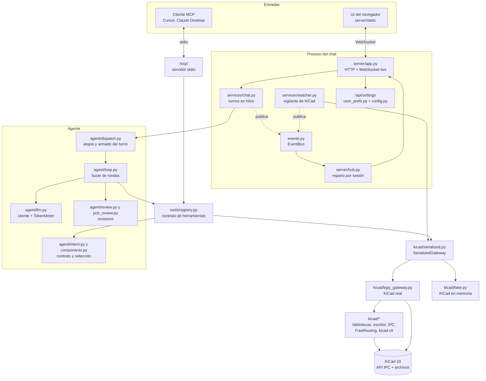

Se lee de arriba abajo. Hay dos entradas: el navegador, que es la forma normal de usar el plugin, y un cliente MCP, que pone su propio modelo. Las dos acaban en el mismo **registro de herramientas** y en el mismo **gateway**, así que una regla que se cumple en un lado se cumple en el otro, salvo los revisores, que viven en el bucle del chat.

Las flechas punteadas son eventos. El chat y el vigilante no escriben en el WebSocket: publican en el bus y el hub decide a qué navegadores llega cada cosa.

## Arranque

El proceso nace de dos maneras:

- **Desde KiCad.** El botón **KiCad IA** del editor de PCB ejecuta `ipc_entry.py`. Ese archivo añade `src/` al `sys.path` y llama a `serve(open_browser=True)`, que abre el navegador a los 0,8 s y arranca uvicorn en `127.0.0.1:8765`.
- **Desde la terminal.** `python -m kicad_ia` hace lo mismo para desarrollo. `python -m kicad_ia.mcp` arranca otro proceso, el servidor MCP, que no levanta HTTP.

`create_app` en `server/app.py` es donde se conectan las piezas. Conviene leerlo primero: en unas veinte líneas crea cada objeto y le pasa sus dependencias.

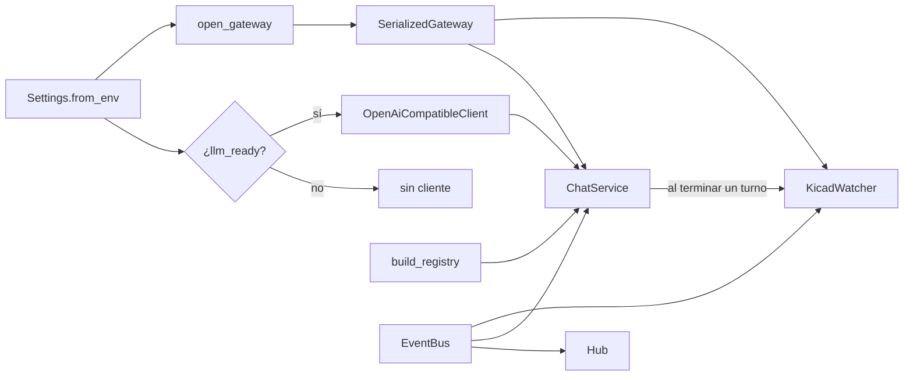

Al arrancar, el hub se engancha al bucle de asyncio y el vigilante empieza su hilo. Al cerrar se paran los dos y se cancela el pool de turnos.

Código: `ipc_entry.py`, `src/kicad_ia/__main__.py`, `server/app.py` (`create_app`, `serve`).

## Configuración y Ajustes

**Qué resuelve.** El usuario configura modelo, Java, autoruteo y reglas de fabricación desde la interfaz, sin tocar archivos. Quien desarrolla puede seguir usando un `.env`.

**Cómo se decide cada valor.**

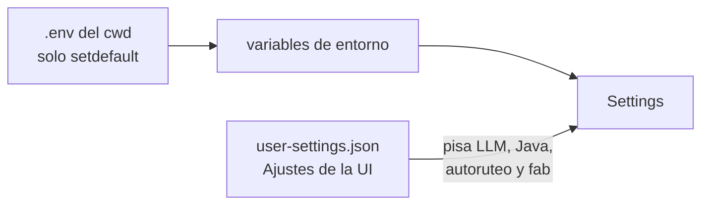

1. `Settings.from_env` lee el `.env` del directorio actual sin pisar variables ya exportadas.
2. Si existe el JSON de Ajustes, `apply_prefs` lo aplica encima. Manda sobre el `.env` en LLM, Java, autoruteo y reglas de fabricación. Puerto, modo de KiCad, `kicad-cli` y FreeRouting solo salen del entorno.
3. Una API key vacía en el JSON no borra la del `.env`; solo la borra una petición explícita (`keep_api_key: false`).

**Al guardar desde la UI** (`PUT /api/settings`): se valida (`validate_and_normalize`), se escribe el JSON, se aplica al `Settings` vivo, se crea un cliente LLM nuevo para el chat, se le pasan los ajustes al gateway real y se fuerza una vuelta del vigilante para que la cabecera cambie al momento. No hace falta reiniciar.

Los presets de proveedor (Gemini, Ollama, OpenAI, personalizado) están en `user_prefs.LLM_PRESETS`. Solo rellenan el formulario (URL y nombre de modelo). El cliente es siempre `OpenAiCompatibleClient` contra `/chat/completions`. El revisor es opcional en todos: misma URL y clave, otro nombre de modelo; vacío = solo reglas duras.

**Dónde vive en disco.** `~/Library/Application Support/kicad-ia/` en macOS, `~/.config/kicad-ia/` en Linux y Windows, o la ruta de `KICAD_IA_CONFIG`.

**Puntos a vigilar.**

- `GET /api/settings` enseña lo efectivo (Ajustes más `.env`), no solo el JSON. Si una variable de entorno fija un valor, la UI lo mostrará aunque el JSON diga otra cosa.
- El revisor usa la misma URL y la misma clave que el modelo principal (cualquier proveedor compatible). Solo cambia el nombre del modelo. Si está vacío, basta el código.

**Para crecer.** Un campo nuevo pasa por `default_prefs`, `validate_and_normalize`, `Settings.apply_prefs`, `SettingsIn` en `app.py` y el formulario de `index.html` / `app.js`.

Código: `config.py`, `user_prefs.py`, `server/app.py`.

## UI del navegador

**Qué es.** Una página estática sin framework: `index.html`, `app.css` y `app.js`. El servidor la sirve en `/` y `/static`. Las imágenes generadas salen por `/renders`.

**Cómo trabaja.** Al cargar abre un WebSocket a `/ws?session=<id>`; el id de la sesión de ese proyecto se guarda en el `sessionStorage` de la pestaña. Todo lo que pinta llega por ese canal:

| Mensaje que recibe | Qué hace la UI |
|---|---|
| `hello` | Estado inicial: KiCad, selección, herramientas, historial y lista de sesiones |
| `status`, `selection` | Refresca la cabecera y la barra lateral |
| `turn.started`, `llm.round`, `llm.text` | Abre el turno, enseña que el modelo está pensando y el texto intermedio |
| `tool.started`, `tool.finished` | Una tarjeta por herramienta, con su etiqueta en español (`TOOL_LABELS`) y la imagen si la trae |
| `llm.usage` | Tokens en la cabecera; `~` si son estimados |
| `turn.finished`, `turn.failed` | Respuesta final o error |
| `sessions`, `session.opened`, `session.preview` | Lista y vista de solo lectura de conversaciones |

Lo que envía: `chat.send`, `ping`, `status.refresh` y los mensajes `session.*` (nueva, abrir, ver, borrar, sincronizar). El modal de Ajustes usa HTTP (`/api/settings`, `/api/settings/probe-java`), no el WebSocket.

Si se cae la conexión, `connect()` reintenta sola. El texto del modelo se pinta con un Markdown mínimo propio (`markdown()` en `app.js`), escapando el HTML.

**Para crecer.** Una herramienta nueva que el usuario vaya a ver en los pasos necesita su etiqueta en `TOOL_LABELS` y, si sus argumentos dicen algo útil, un caso en `briefArgs`.

## Servidor HTTP y WebSocket

**Qué hace.** `server/app.py` es una aplicación FastAPI con pocos endpoints y un WebSocket. No contiene lógica de diseño: traduce mensajes en llamadas al servicio de chat, al vigilante o a los Ajustes.

| Ruta | Para qué |
|---|---|
| `GET /` y `/static` | La UI |
| `GET /renders/...` | Imágenes de `render_view`, colocación y autoruteo |
| `GET /api/status`, `/api/selection`, `/api/tools` | Lecturas sueltas, útiles para depurar |
| `GET/PUT /api/settings`, `POST /api/settings/probe-java` | Ajustes |
| `POST /api/chat` | Un turno síncrono, sin eventos (pruebas y scripts) |
| `WS /ws` | El canal del chat |

**Ciclo de un WebSocket.**

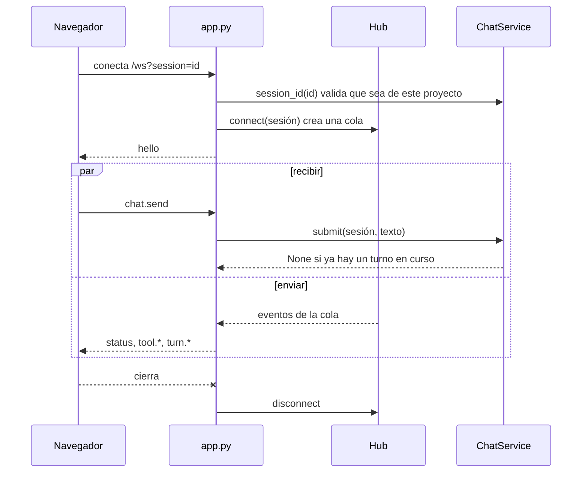

Cada conexión tiene dos tareas: una lee lo que manda el navegador y otra vacía la cola del hub hacia el socket. Si el navegador pide una sesión de otro proyecto, `ChatService.session_id` le da una nueva: el historial no cruza proyectos.

**Puntos a vigilar.**

- Un mensaje de chat se corta a 8000 caracteres (`MAX_MESSAGE`).
- No se puede cambiar ni borrar la sesión activa mientras su turno está en marcha: se responde con `error`.

## Bus de eventos y hub

**Por qué existen.** El turno del chat y el vigilante corren en hilos normales; el WebSocket vive en el bucle de asyncio. El bus desacopla los dos mundos: quien produce un evento no sabe quién lo escucha.

**Bus** (`events.py`). Lista de suscriptores protegida por un candado. `publish` llama a cada uno en el hilo de quien publica; si uno falla, se registra y se sigue con el resto. Los tipos de evento son constantes del mismo archivo.

**Hub** (`server/hub.py`). Es el único suscriptor del servidor. Por cada evento:

1. Si es `status` o `selection`, guarda una copia en `snapshot`. Así el `hello` de una pestaña nueva sale al instante, sin preguntar a KiCad.
2. Lo pasa al bucle de asyncio con `call_soon_threadsafe`.
3. Lo mete en la cola de cada cliente. Si el evento trae `target`, solo lo reciben los clientes de esa sesión; los de estado van a todos.

Cada cola guarda hasta 200 mensajes. Si se llena, se tira el más viejo: una pestaña lenta pierde eventos intermedios, pero no bloquea a nadie.

**Puntos a vigilar.** Un evento nuevo que deba llegar solo a una conversación tiene que publicarse con `target=session_id`. Sin `target` lo ven todas las pestañas abiertas.

## Vigilante de KiCad

**Qué resuelve.** La cabecera y la barra lateral reflejan KiCad sin que el usuario pulse nada: conexión, proyecto, selección, modelo y tokens. Además reconecta solo cuando KiCad se cierra y se vuelve a abrir.

**Cómo trabaja.** Un hilo propio repite cada `WATCH_INTERVAL` segundos (1,5 por defecto):

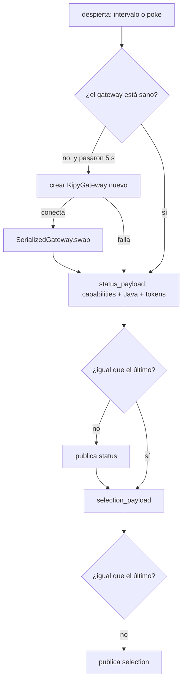

Solo publica cuando el contenido cambia: compara el JSON ordenado con el anterior. Por eso los payloads no llevan marcas de tiempo. `poke()` lo despierta antes de tiempo; `poke(force=True)` además olvida lo último publicado y obliga a reenviarlo. El chat lo llama al terminar cada turno y los Ajustes al guardar.

**Puntos a vigilar.**

- Cada vuelta llama a `capabilities()`. En `KipyGateway` eso consulta los documentos abiertos, ejecuta `java -version`, calcula el SHA-256 del JAR de FreeRouting si está en caché y resume las bibliotecas. Todo ocurre dentro del candado del gateway, así que una herramienta que llegue en ese momento espera. Es el primer sitio a mirar si el chat va lento o si la CPU sube con el plugin en reposo.
- La reconexión solo existe si el modo no es `fake` y el gateway se creó por configuración.

Código: `services/watcher.py`.

## Servicio de chat y conversaciones

**Qué hace.** `ChatService` recibe un texto, lo ejecuta fuera del bucle de asyncio, publica cada paso como evento y guarda la conversación.

**Cómo trabaja un turno.**

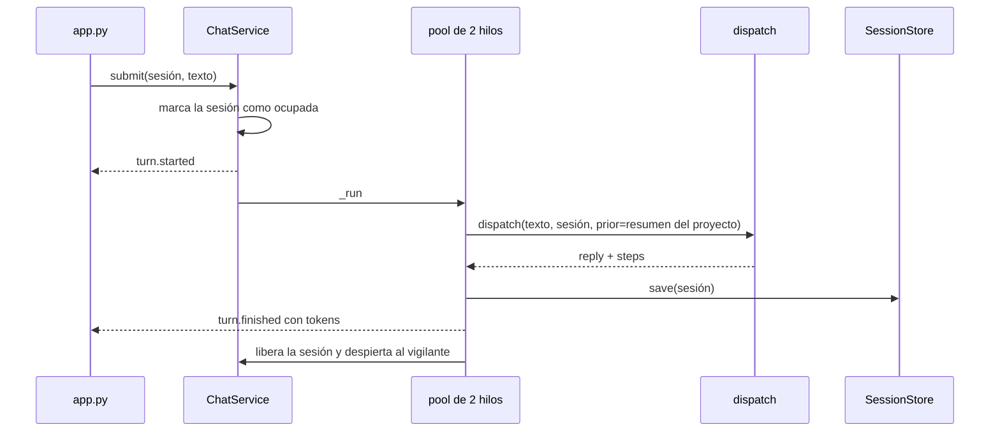

- **Una sesión, un turno.** Si la sesión ya está ocupada, `submit` devuelve `None` y el usuario ve «Todavía estoy con el mensaje anterior». Dos sesiones distintas sí pueden correr a la vez, porque el pool tiene dos hilos; comparten gateway y contador de tokens.
- **Proyecto.** Cada sesión queda marcada con la carpeta del proyecto abierto. Si KiCad parpadea, se conserva la última carpeta conocida.
- **Memoria entre sesiones.** Antes de cada turno, `SessionStore.digest` resume las otras conversaciones del mismo proyecto: hasta cinco peticiones del usuario y la última respuesta de cada una, ocho sesiones como mucho y 3500 caracteres en total. Ese resumen entra en el prompt como memoria de solo lectura.

**En disco.** Cada sesión es un JSON en `sessions/`, junto a los Ajustes. Guarda los mensajes, incluidos los resultados completos de las herramientas, y la `DesignMemory` (contrato y piezas aceptadas). No guarda la API key. Una sesión sin texto de usuario no se escribe.

**Puntos a vigilar.**

- La lista y el resumen leen todos los JSON de `sessions/` en cada llamada. Con muchas conversaciones largas, se nota.
- Abrir una sesión vieja enseña su texto; no la continúa. El modelo solo la ve a través del resumen.

Código: `services/chat.py`, `agent/sessions.py`.

## Agente

Aquí está el razonamiento. El reparto de papeles entre orquestador, intención, selección y revisores se explica en [agents.md](agents.md); esta sección cuenta cómo se ejecuta.

### dispatch: antes del modelo

`agent/dispatch.py` decide si hace falta el modelo:

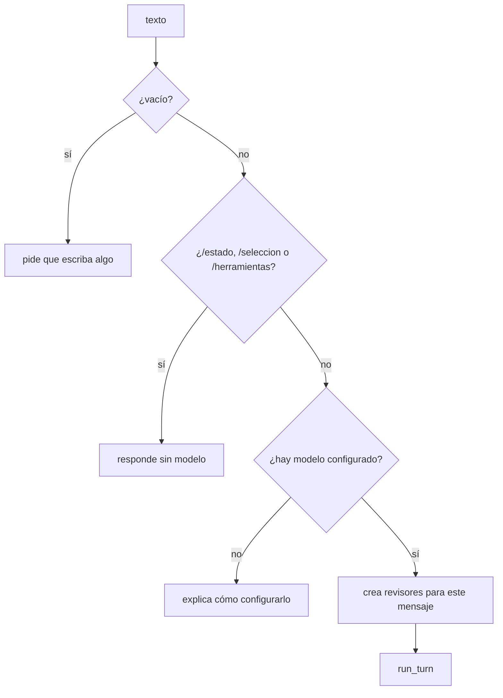

Los atajos también se guardan en la conversación. Los revisores se crean en cada mensaje, así que su límite de rechazos es por mensaje, no por sesión. `shrink_step` recorta a la UI los pasos de más de 4000 caracteres; el modelo sigue recibiendo el resultado entero.

### El bucle de rondas

`run_turn` en `agent/loop.py` es el orquestador. Antes de empezar fija la `DesignMemory` de la sesión en un `ContextVar`, para que las herramientas la encuentren sin recibirla como argumento.

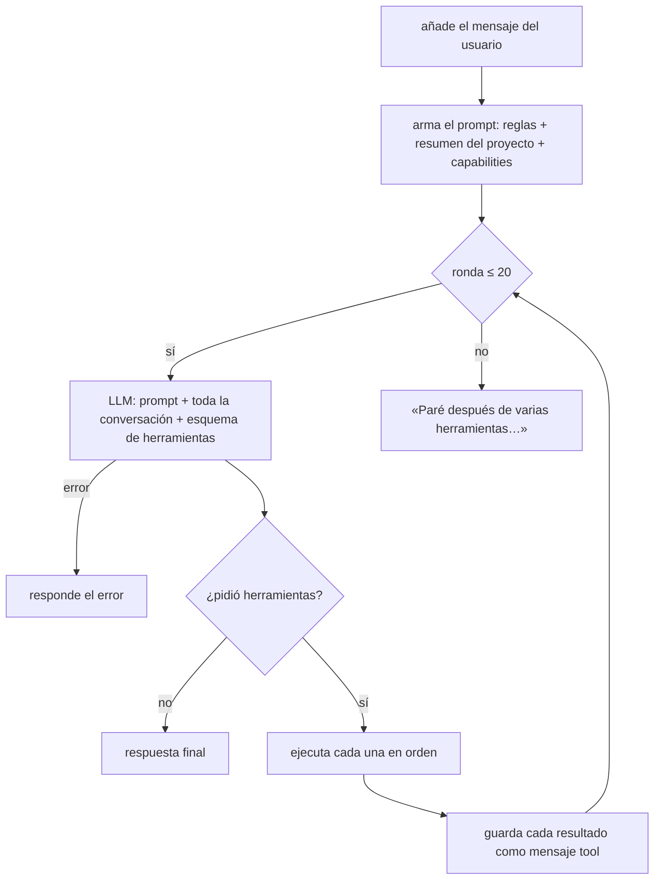

Lo que hay que tener presente para entender coste y comportamiento:

- **Historial compactado al cerrar el turno.** Al empezar un mensaje nuevo, `compact_closed_turns` deja los `tool` anteriores en un resumen (ok, decisión, ids). El turno en curso sigue crudo. Ver [agente-coste.md](agente-coste.md).
- **Deduplicación por turno.** Misma herramienta y mismos argumentos → resultado corto sin reejecutar, salvo tras un rechazo.
- **Una ronda puede traer varias herramientas.** El prompt pide agrupar búsquedas y descripciones independientes; si el modelo las pide de una en una, gasta una ronda por herramienta.
- **El tope es de 20 rondas por mensaje.** Al llegar se corta con un texto fijo, haya repetición o no. Un circuito grande hecho paso a paso puede tocar el tope sin estar en bucle.
- **Revisores dentro del bucle.** `_call_tool` pasa `place_circuit` por `guard_place`, luego reglas duras eléctricas y, si hay modelo revisor, el LLM; los candidatos de colocación y autoruteo por el revisor de PCB después.

### Cliente LLM y tokens

`OpenAiCompatibleClient` habla con cualquier `/chat/completions` compatible con OpenAI: temperatura 0,2, tres intentos ante errores de red y respuestas 429/5xx, y espera lo que diga `retry-after` (hasta 30 s). Convierte las `tool_calls` en `ToolCall` y conserva los campos extra que mande el proveedor, como las firmas de Gemini, para devolverlos en la ronda siguiente.

`TokenMeter` (`USAGE`) suma lo que cobra el proveedor desde que arrancó el proceso: modelo principal y revisores juntos. Lee el formato de OpenAI y el `usageMetadata` de Gemini. Si el proveedor no informa nada, estima unos cuatro caracteres por token y la UI lo marca con `~`.

### Revisores

| Revisor | Cuándo corre | Qué recibe | Qué decide |
|---|---|---|---|
| Eléctrico (`review.py`) | Antes de cada `place_circuit` | Guardia de intención, luego reglas duras; opcionalmente el modelo revisor | Aprueba o devuelve hasta 6 problemas; tras 2 rechazos en el mensaje, `exhausted` |
| PCB (`pcb_review.py`) | Después de una vista previa de colocación o autoruteo que salió bien | Informe DRC/IPC, score y baseline | Primero reglas duras sin modelo; si pasan y hay revisor, le pregunta |

Los dos pueden responder con una herramienta `verdict` cuando hay modelo. Si el modelo revisor falla, el eléctrico deja escribir tras las reglas duras y lo anota como `skipped`; el de PCB, igual. Sin `LLM_REVIEW_MODEL`, bastan las reglas duras.

**Puntos a vigilar.**

- `guard_place` corre en el bucle **antes** del revisor y otra vez en el registry (MCP).
- Cuando un revisor de PCB rechaza, el resultado vuelve con `ok: false` pero conserva el `candidate_id`. Aplicar ese candidato no comprueba si fue aprobado (ver [Candidatos](#candidatos-vista-previa-y-aplicar)).
- Por MCP no hay revisores LLM: sí `guard_place` y el resto del registry.

**Para crecer.** Un revisor nuevo se engancha en `_call_tool` y se crea en `dispatch`. Si debe valer también por MCP, la regla tiene que vivir en el registro o en el gateway.

Código: `agent/dispatch.py`, `agent/loop.py`, `agent/llm.py`, `agent/review.py`, `agent/pcb_review.py`.

## Registro de herramientas

**Qué es.** `tools/registry.py` define cada herramienta una sola vez: nombre, descripción para el modelo, esquema JSON de argumentos y una función (handler) que valida y llama al gateway. El chat lo convierte al formato de OpenAI (`openai_tools`) y el servidor MCP al de MCP. Es el contrato común de las dos entradas.

**Cómo se ejecuta una llamada.**

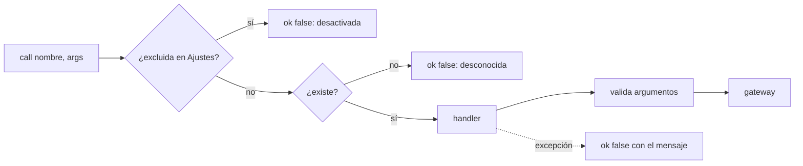

Una herramienta nunca lanza una excepción al bucle: todo error vuelve como `{"ok": false, "error": ...}` para que el modelo lo lea y se lo diga al usuario. Hoy la única que se puede excluir es `autoroute_board`, cuando el autoruteo está apagado.

**Grupos de herramientas.**

| Grupo | Herramientas | Qué tocan |
|---|---|---|
| Lectura | `inspect_context`, `board_state`, `list_models`, `routing` (status) | Nada; solo leen |
| Bibliotecas | `search_parts`, `describe_part`, `describe_footprint`, `search_lcsc`, `import_lcsc` | Leen tablas; `import_lcsc` añade una biblioteca al proyecto |
| Diseño | `commit_intent`, `select_component` | Solo la memoria de la sesión |
| Esquemático | `place_circuit`, `assign_footprint`, `organize_layout` (schematic) | El `.kicad_sch`, con copia |
| Paso a placa | `sync_board`, `render_view` | Nada; ERC, netlist e imágenes |
| Placa | `move_footprints`, `organize_layout` (pcb), `ipc_place_components`, `ipc_validate_correct`, `autoroute_board` | La placa viva, algunas con vista previa |

Las dos que deciden diseño, `commit_intent` y `select_component`, no van al gateway a escribir: leen y guardan en la `DesignMemory` activa (`current_memory`). `place_circuit` pasa por `guard_place` antes de llamar al gateway. Así las reglas de intención se cumplen también por MCP.

**Puntos a vigilar.**

- `move_footprints` con `apply` por defecto mueve la placa sin vista previa. `organize_layout` conviene primero con `apply=false` (plan, `eligible`, `draw_frames`, `ambiguous`); en el esquemático, aplicar rehace la hoja (deja copia) y solo dibuja recuadros si hay ≥2 etapas elegibles.
- Herramienta nueva: registro, método abstracto en `Gateway`, implementación en `KipyGateway` y `FakeGateway`, prueba con `FakeGateway` y etiqueta en la UI. Ver la lista en `app/AGENTS.md`.

## Gateways

**Por qué existen.** Las herramientas no importan `kipy` ni leen archivos de KiCad. Piden cosas a un objeto con un contrato fijo (`kicad/gateway.py`). Eso permite tres cosas: probar todo sin KiCad, reconectar sin reiniciar y garantizar que solo un hilo habla con KiCad a la vez.

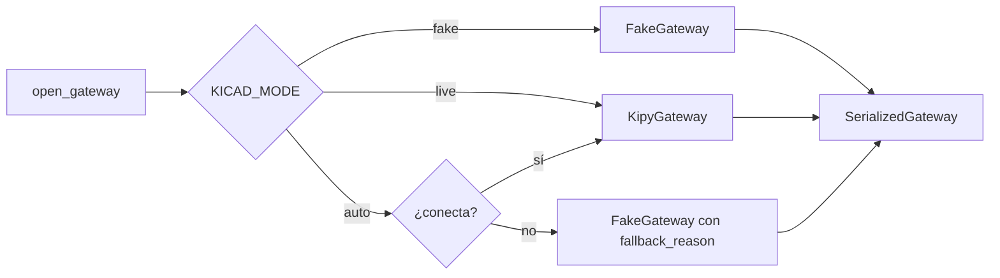

### SerializedGateway

Envuelve al gateway real. Cada método se ejecuta bajo un `RLock`: el cliente de `kipy` no es seguro entre hilos, y el vigilante, los turnos y el MCP llaman a la vez. `swap()` cambia el gateway de dentro sin que nadie suelte su referencia; así reconecta el vigilante.

Los atributos que se asignan al envoltorio (por ejemplo la `design_memory` del MCP) se quedan en él y sobreviven a un `swap`.

### KipyGateway: KiCad real

Combina tres vías de acceso, porque KiCad 10 no lo expone todo por API:

| Qué | Cómo |
|---|---|
| Placa, selección, huellas, cobre | API IPC con `kipy` |
| Esquemático | Leer y escribir el `.kicad_sch` (no hay API de esquemático en KiCad 10) |
| ERC, DRC, netlist, imágenes | `kicad-cli` |
| DSN/SES para FreeRouting | El Python que trae KiCad (`pcbnew`) en un subproceso |
| Bibliotecas | Las mismas `sym-lib-table` y `fp-lib-table` de KiCad, leídas del disco |

El proyecto se deduce de los documentos abiertos: primero la placa y, si no hay, el esquemático. La hoja que se escribe es `<proyecto>.kicad_sch`, la raíz.

`capabilities()` es la fuente de verdad de lo que funciona en ese momento: placa abierta, esquemático bloqueado por el editor, `kicad-cli`, `pcbnew`, Java, FreeRouting, autoruteo y notas para el usuario. Entra en el prompt de cada turno y en la cabecera.

### FakeGateway: KiCad en memoria

Mismo contrato, sin editor. Guarda símbolos, etiquetas y huellas en memoria y usa un catálogo corto (`catalog.py`) como biblioteca. Las pruebas lo usan siempre y el modo `auto` cae en él si KiCad no responde; en ese caso `capabilities()` dice `backend: fake` y la nota con el motivo.

**Puntos a vigilar.**

- Proyectos jerárquicos: solo se lee y escribe la hoja raíz.
- Con `backend: fake` nada llega a KiCad. El modelo no debe afirmar cambios, y la cabecera lo enseña.
- `capabilities()` es cara (ver [Vigilante](#vigilante-de-kicad)).

Código: `kicad/gateway.py`, `kicad/session.py`, `kicad/serialized.py`, `kicad/kipy_gateway.py`, `kicad/fake.py`, `kicad/catalog.py`.

## Bibliotecas

**Qué resuelve.** Las piezas salen de las bibliotecas que el usuario ya tiene en KiCad, no de una lista del plugin.

**Cómo trabaja** (`kicad/libraries.py`):

1. `detect_paths` localiza la configuración de KiCad según la versión y el sistema.
2. `LibraryIndex` lee `sym-lib-table` y `fp-lib-table`, global y del proyecto, y expande variables como `${KICAD10_SYMBOL_DIR}` o `${KIPRJMOD}`.
3. **Símbolos.** Escanea cada `.kicad_sym` y guarda en caché, en disco, nombre, descripción, palabras clave, huella por defecto y datasheet. La caché se invalida por fecha y tamaño de cada archivo, así que solo se reescanea lo que cambió.
4. **Huellas.** Lista los `.kicad_mod` de cada `.pretty`. Esa lista vive en memoria mientras vive el índice.
5. **Búsqueda.** Puntúa la consulta contra el nombre y el texto, y ordena por puntuación y por nombre más corto.
6. **Descripción.** `describe_symbol` abre el archivo y saca pines (número, nombre, tipo, unidad), filtros de huella y si es símbolo de alimentación. `describe_footprint` cuenta pads y resuelve los modelos 3D.

El índice se rehace cuando cambia el proyecto abierto o después de `import_lcsc`.

**LCSC** (`kicad/lcsc.py`). Si la pieza no está, `search_lcsc` consulta el catálogo de JLCPCB y `import_lcsc` usa `easyeda2kicad` para bajar símbolo, huella y 3D a `kicad-ia.kicad_sym` y `kicad-ia.pretty` del proyecto, y los añade a sus tablas.

**Puntos a vigilar.** Una biblioteca añadida a mano en KiCad con el chat abierto no aparece hasta que cambie el proyecto o se reinicie el plugin.

## Escritor de esquemático

**Qué resuelve.** KiCad 10 no deja escribir el esquemático por API. El plugin edita el `.kicad_sch` directamente, con las mismas reglas de retícula que usa KiCad para dar por conectados pin y cable.

**Cómo escribe un circuito** (`write_circuit` en `kicad/sch_writer.py`):

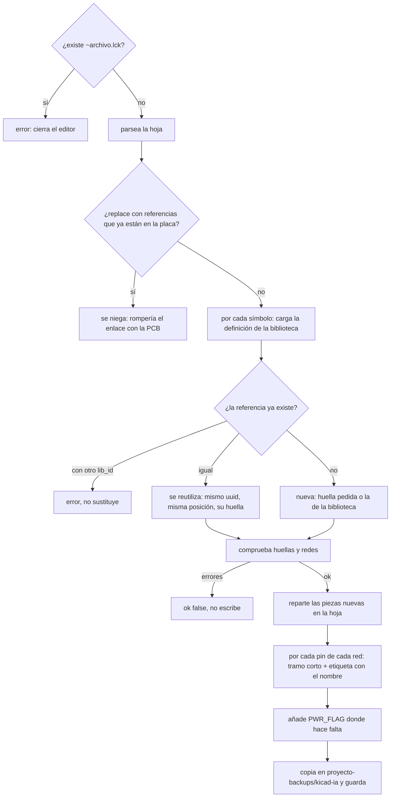

Las redes no se dibujan como cables largos. Cada pin recibe un tramo de 2,54 mm y una etiqueta local con el nombre de la red; KiCad une por nombre. Así no hay cables que se crucen por accidente y la hoja se puede reordenar después.

Si la referencia ya está en la placa, el símbolo nuevo toma el uuid que la huella tiene enlazado. Es lo que permite que F8 actualice en lugar de duplicar.

Después de escribir, el gateway lanza el ERC con `kicad-cli` y añade `erc.verdict` y `erc.problems` al resultado. Ignora los avisos de pines sin usar al decidir si está limpio.

**Puntos a vigilar.**

- Una pieza reutilizada no recibe etiqueta en una red cuyo nombre ya existe en la hoja. Si se le pide conectar otro pin suyo a esa misma red, ese pin puede quedar sin etiqueta; conviene comprobarlo en el ERC.
- Solo se coloca la unidad 1 de cada símbolo, y solo se conectan sus pines y los comunes a todas las unidades. En un símbolo de varias unidades (un doble amplificador, por ejemplo), un pin de la unidad B da «no tiene el pin».
- `organize_layout` en el esquemático rehace la hoja: se pierden cables y textos puestos a mano, aunque queda copia.

Código: `kicad/sch_writer.py`, `kicad/sexpr.py`, `kicad/geometry.py`, `kicad/layout.py`, `kicad/circuit.py`.

## kicad-cli, imágenes y área de placa

`kicad/cli.py` envuelve las llamadas a `kicad-cli`: ERC en JSON resumido (veredicto, recuento por tipo, hasta 20 problemas), DRC de la placa y exportación de la netlist. Si no encuentra `kicad-cli`, las herramientas que lo necesitan devuelven `ok: false` con la causa.

`kicad/render.py` genera imágenes en la caché `kicad-ia/renders`, que el servidor sirve en `/renders`: SVG para el esquemático y la placa en 2D, PNG para las vistas 3D. Borra las más viejas para que la carpeta no crezca sin límite.

`kicad/board_area.py` calcula el texto que el modelo tiene que repetir al pasar a la placa (`board_area.must_tell_user`): el rectángulo de Edge.Cuts si existe; la caja de las huellas más 5 mm si no hay contorno pero ya hay huellas; o la orden de no elegir el tamaño a ojo y medir después de F8.

`sync_board` junta ERC, netlist, símbolos sin huella y área de placa, y devuelve el paso F8. No importa la netlist a la placa: `kipy` no puede.

## Colocación y validación IPC

**Qué resuelve.** Repartir las huellas en la placa siguiendo holguras de ensamblaje y revisar una placa existente. Es un prechequeo de diseño inspirado en IPC-2221C e IPC-7351, no una certificación.

**Cómo trabaja** (`kicad/ipc.py`, `kicad/layout.py`):

1. Lee de la placa viva cada huella con su caja, el contorno de Edge.Cuts y las redes.
2. Si el modelo no pasó grupos, `auto_groups` junta cada pasivo con el integrado al que sirve, siguiendo las redes.
3. `place_ipc` reparte los grupos en bloques dentro del contorno, con las holguras de Clase 2: 0,5 mm entre cuerpos, 2 mm entre grupos y 1 mm al borde. Pone primero los grupos con conectores y después empuja cada conector al borde más cercano. Los pasivos quedan a 0° y las huellas bloqueadas no se mueven. El desacoplo sale de la agrupación: el condensador va en el bloque de su integrado.
4. `audit_placement` revisa el resultado y produce los hallazgos (`error`, `warning`, `info`), cada uno con sus referencias y si se puede corregir solo.

`ipc_place_components` con `apply=false` guarda el plan como candidato y genera una imagen moviendo las huellas en una copia del archivo de placa. `ipc_validate_correct` audita la placa actual y, con `apply=true`, mueve solo las correcciones marcadas como seguras.

Solo la Clase 2 está calibrada: otra clase usa los mismos umbrales y lo avisa.

## Autoruteo

**Qué resuelve.** Rutear la placa con FreeRouting sin tocar la placa viva hasta que el usuario confirme.

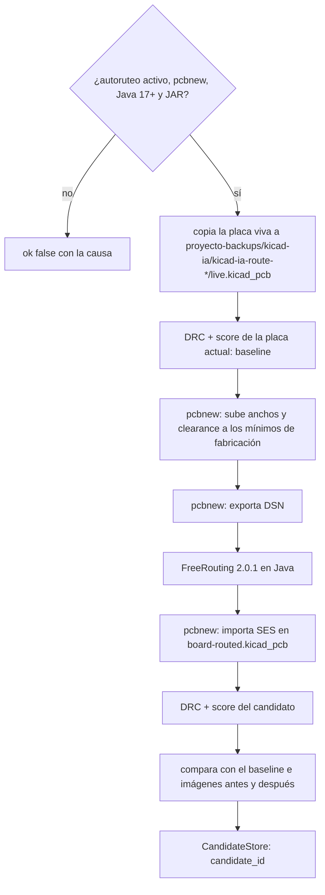

- **pcbnew en subproceso.** `kicad-cli` 10 no exporta DSN; el Python de KiCad sí. `pcbnew_bridge.py` genera un script corto y lo ejecuta con ese Python. En macOS lo encuentra solo; en Linux y Windows hay que darle `KICAD_PYTHON`.
- **Reglas de fabricación.** Antes del DSN se suben anchos de pista, clearance y vías de cada clase de red hasta los mínimos de Ajustes. Nunca se achica lo que puso el usuario.
- **FreeRouting.** Versión fijada 2.0.1, verificada por SHA-256 y guardada en la caché. Se descarga al primer uso si `FREEROUTING_DOWNLOAD` lo permite.
- **Comparación.** `pcb_metrics.py` puntúa errores DRC, redes sin rutear, vías y longitud. Los errores que ya existían antes de rutear se listan aparte y no culpan al autoruteo.
- **Aplicar.** `copper_apply.py` lee segmentos y vías del candidato y los crea en la placa viva por `kipy`, emparejando redes por nombre. Antes se guarda una copia de la placa.

## Candidatos: vista previa y aplicar

Colocación y autoruteo siguen el mismo patrón de dos pasos:

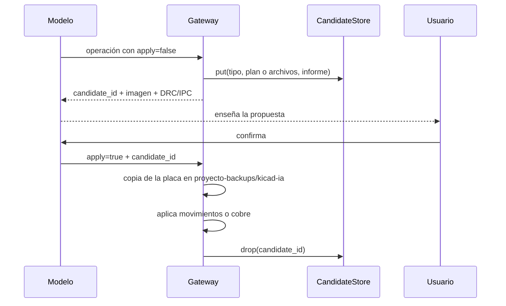

`CandidateStore` (`kicad/candidates.py`) es un diccionario en memoria con caducidad de una hora. Cada candidato guarda su tipo, el plan o los archivos y el informe.

**Puntos a vigilar.**

- Aplicar no comprueba `approved` ni el veredicto del revisor. La protección es que el modelo solo aplique tras confirmación del usuario.
- El candidato no se compara con la placa en el momento de aplicar. Si el usuario movió piezas entre la vista previa y la confirmación, se aplica lo calculado antes.
- Los candidatos se pierden al reiniciar el proceso.
- Al caducar se borran los archivos del candidato, pero la carpeta de trabajo del autoruteo sigue en `<proyecto>-backups/kicad-ia/`.

## Servidor MCP

**Qué es.** Un proceso aparte (`python -m kicad_ia.mcp`) que expone el mismo registro por MCP stdio. El modelo lo pone el cliente: Cursor, Claude Desktop u otro.

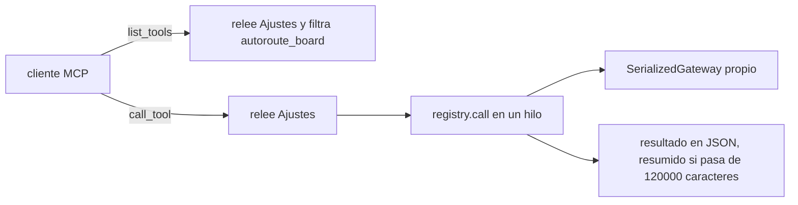

Comparte con el chat el registro, los gateways, las bibliotecas y los Ajustes en disco. No comparte el proceso: tiene su propio gateway, su `CandidateStore` y una `DesignMemory` por proceso. No hay revisores, ni tope de rondas, ni resumen de sesiones; eso queda en manos del cliente. Los registros van a stderr porque stdout es el protocolo.

Detalle de instalación y configuración: [mcp.md](mcp.md).

## Archivos que crea el plugin

| Dónde | Qué | Quién |
|---|---|---|
| Carpeta de Ajustes / `user-settings.json` | Ajustes, con la API key | `user_prefs.py` |
| Carpeta de Ajustes / `sessions/*.json` | Conversaciones y memoria de diseño | `agent/sessions.py` |
| Caché `kicad-ia/` | Índice de símbolos, imágenes en `renders/`, JAR de FreeRouting | `libraries.py`, `render.py`, `freerouting.py` |
| Proyecto / `<nombre>-backups/kicad-ia/` | Copias del esquemático y de la placa, trabajo de autoruteo, vistas previas | `backups.py`, `sch_writer.py`, `kipy_gateway.py` |
| Proyecto / `kicad-ia.kicad_sym`, `kicad-ia.pretty` | Piezas importadas de LCSC | `lcsc.py` |
| Proyecto / `.kicad-ia-place-preview.kicad_pcb` | Placa temporal para la imagen de colocación; se borra al terminar | `kipy_gateway.py` |

La caché está en `~/Library/Caches/kicad-ia` en macOS, en `~/.cache/kicad-ia` en Linux, o en `KICAD_IA_CACHE`.

## Pruebas

`cd app && .venv/bin/pytest`. No necesitan KiCad: usan `FakeGateway` y una biblioteca de ejemplo de `tests/conftest.py`, y `ScriptedClient` en lugar de un modelo real para probar el bucle. Después de tocar el escritor de esquemático, conviene pasar un ERC real con `kicad-cli sch erc` sobre un proyecto de prueba.
