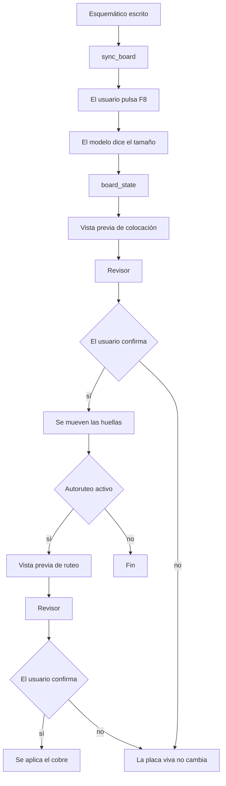
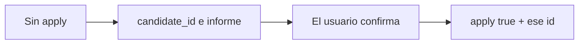
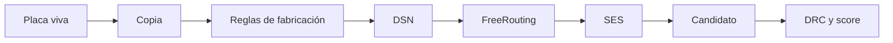
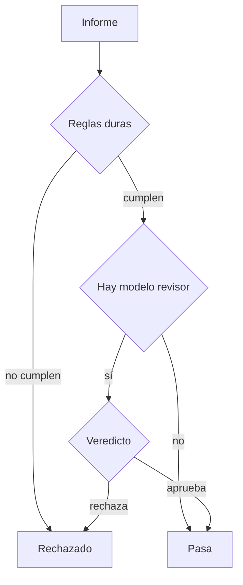
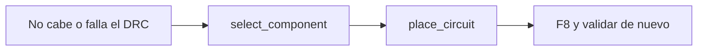

# Cómo se genera la placa

Un solo modelo lleva la conversación. El código coloca las huellas, rutea el cobre y mide el resultado. El modelo elige el momento de cada paso y cómo contárselo al usuario. No calcula posiciones ni pistas.

El contrato de intención, la elección de piezas y los tokens están en [agents.md](agents.md). Las capas del programa están en [architecture.md](architecture.md).

## Quién interviene

| Quién | Qué hace en la placa |
|---|---|
| Orquestador (`LLM_MODEL`) | Sigue el procedimiento y llama a la herramienta que toca. Hasta 20 rondas por mensaje. |
| Código de placa | Coloca, autorutea, pasa el DRC y guarda el candidato. |
| Revisor de PCB | Mira el informe de la vista previa. No mueve nada. |
| Usuario | Actualiza la placa con F8 y confirma antes de aplicar. |

Intención y selección de componentes no diseñan la placa. La selección solo vuelve a entrar si una huella no cabe, no cumple el clearance o falla el DRC.

Cada mensaje crea un revisor nuevo. Si en Ajustes hay `LLM_REVIEW_MODEL`, ese segundo modelo da el veredicto. Si no hay, pasan solo las reglas duras.

## Del esquemático a la placa

`sync_board` valida el esquemático y dice que toca F8. No importa la placa por su cuenta: el usuario actualiza el editor de PCB.

En esa misma respuesta el modelo copia `board_area.must_tell_user`. Ese texto trae el contorno de Edge.Cuts, o la caja de las huellas más 5 mm, o la orden de volver a medir. Sin ese contorno no se coloca ni se autorutea. El cálculo está en `kicad/board_area.py`.

## Vista previa y aplicar

Colocación y autoruteo usan el mismo gesto: primero se mira, después se escribe.

La vista previa queda en `CandidateStore`. Aplicar es otra llamada: recupera ese candidato y lo pasa a la placa viva. No vuelve a calcular el plan.

La espera de la confirmación está en la instrucción del orquestador. Cuando la herramienta recibe `apply` verdadero y un `candidate_id` válido, escribe.

Si el autoruteo está apagado en Ajustes, `autoroute_board` no aparece entre las herramientas.

## Qué calcula el código

### Colocación

`ipc_place_components` llama a `place_ipc`. No mueve huellas bloqueadas. Agrupa por la lista del modelo o, si no hay lista, por las redes. Los conectores van al borde. Las holguras salen del pre-chequeo IPC Clase 2. El informe avisa si ya hay pistas: al mover los pads quedan desconectadas.

Es un pre-chequeo, no una certificación IPC.

### Autoruteo

Trabaja sobre una copia.

FreeRouting queda fijado en la 2.0.1, con Java 17 o superior. El modelo puede pedir clases de red que no se toquen (por ejemplo GND si ya hay plano) y un tope de pasadas. El candidato se compara con la placa de partida: `better_than`, errores nuevos y redes sin rutear.

Hasta que la respuesta trae `applied: true`, la placa no está ruteada.

## El revisor

Solo entra en la vista previa de `ipc_place_components` y de `autoroute_board`.

Las reglas duras rechazan si hay errores DRC nuevos, si el autoruteo dejó redes sin rutear, si el score empeora, o si hay un hallazgo IPC de severidad error. En ese caso el modelo revisor no se consulta.

Si las reglas pasan y hay modelo revisor, ese modelo puede aprobar con avisos o rechazar con hasta ocho problemas concretos. Dos rechazos en el mismo mensaje; al tercero el veredicto es `exhausted` y no se aplica.

El rechazo vuelve al orquestador como `ok: false`. La instrucción es no aplicar.

## Si una pieza no cabe

Un sustituto deja `change_set.requires_revalidation`. Volver a escribir el esquemático, actualizar la placa y validar otra vez es parte de la instrucción del modelo. Un cambio de arquitectura no se aplica solo.

## Otros gestos

| Gesto | Qué hace |
|---|---|
| `organize_layout` en la placa | Reparte por grupos. Por defecto mueve ya, sin candidato ni revisor. |
| `ipc_validate_correct` | Audita. Con `apply` solo mueve correcciones seguras: un solape leve, salir del borde, acercar un desacoplo. El resto queda en recomendaciones. |
| `move_footprints` | Mueve referencias que ya están en la placa a coordenadas pedidas. |

## Dónde se puede aligerar

El orden de arriba se mantiene. El peso está en el modelo, que tiene que acordarse del procedimiento.

- Esquemático, búsqueda de piezas, colocación y ruteo comparten las mismas 20 rondas y el mismo historial. Cada herramienta devuelve su resultado completo al modelo.
- El modelo revisor solo aporta juicio cuando las reglas duras ya dejaron pasar el candidato.
- `organize_layout` mueve al momento. La colocación IPC espera confirmación. Un pedido vago puede mezclar los dos.
- `requires_revalidation` queda escrito, y el modelo es quien tiene que repetir ERC, F8 y DRC.

Lo que sigue diseñado y aún no está: un agente de placa aparte, un análisis de impacto antes de cambiar una huella, y una comprobación del pedido contra la placa terminada. La lista está al final de [agents.md](agents.md).
